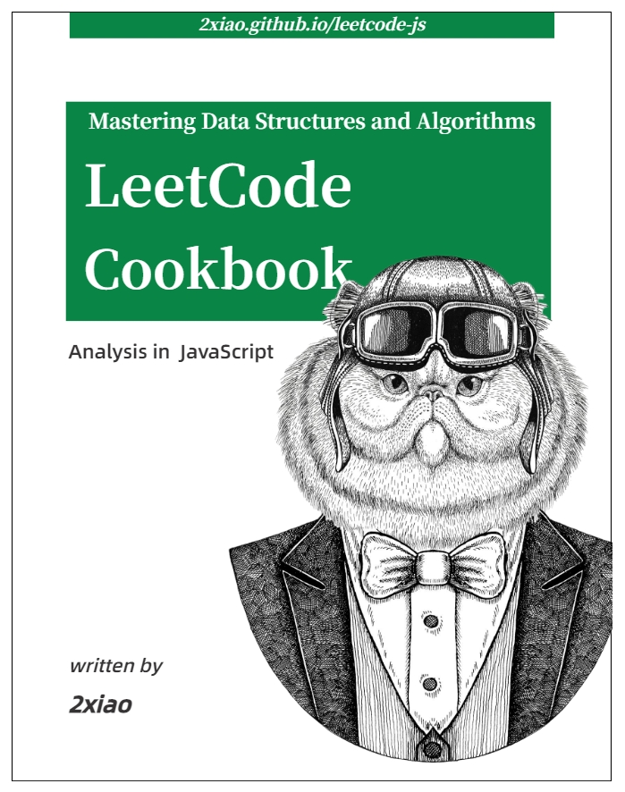

# 前端算法通关指南 (LeetCode-JS)

## 项目简介

- 「算法与数据结构」 基础知识讲解，「LeetCode」800+ 道题目详细解析；
- 前端工程师友好，书中的算法全部使用 `JavaScript` 语言实现；
- 前端基础知识，JavaScript 核心原理解析，React 源码解析；
- 肉身翻墙指南；

## 项目地址

欢迎右上角 「Star ⭐️ 」 和 「Fork」，这是对我最大的鼓励和支持。

GitHub 地址：[https://github.com/2xiao/leetcode-js](https://github.com/2xiao/leetcode-js)

电子书地址：[https://2xiao.github.io/leetcode-js/leetcode/](https://2xiao.github.io/leetcode-js/leetcode/)

  

### 目录

### 第一章 序言

- [1.1 数据结构与算法](https://2xiao.github.io/leetcode-js/leetcode/outline/table)
- [1.2 复杂度分析](https://2xiao.github.io/leetcode-js/leetcode/outline/complexity)
- [1.3 LeetCode 题解](https://2xiao.github.io/leetcode-js/leetcode/outline/solution_list)
- [1.4 学习计划](https://2xiao.github.io/leetcode-js/leetcode/outline/plan/)
- [1.5 题解标签](https://2xiao.github.io/leetcode-js/leetcode/outline/tag/)

### 第二章 数据结构专题

- [2.1 数组](https://2xiao.github.io/leetcode-js/leetcode/ds/array)
- [2.2 链表](https://2xiao.github.io/leetcode-js/leetcode/ds/linked_list)
- [2.3 栈](https://2xiao.github.io/leetcode-js/leetcode/ds/stack)
- [2.4 队列](https://2xiao.github.io/leetcode-js/leetcode/ds/queue)
- [2.5 哈希表](https://2xiao.github.io/leetcode-js/leetcode/ds/hash_table)
- [2.6 树](https://2xiao.github.io/leetcode-js/leetcode/ds/tree)
- [2.7 堆](https://2xiao.github.io/leetcode-js/leetcode/ds/heap)
- [2.8 图](https://2xiao.github.io/leetcode-js/leetcode/ds/graph)
- [2.9 字符串](https://2xiao.github.io/leetcode-js/leetcode/ds/string)

### 第三章 算法专题

- [3.1 枚举算法](https://2xiao.github.io/leetcode-js/leetcode/algorithm/enumeration)
- [3.2 递归算法](https://2xiao.github.io/leetcode-js/leetcode/algorithm/recursion)
- [3.3 分治算法](https://2xiao.github.io/leetcode-js/leetcode/algorithm/divide_conquer)
- [3.4 回溯算法](https://2xiao.github.io/leetcode-js/leetcode/algorithm/backtracking)
- [3.5 贪心算法](https://2xiao.github.io/leetcode-js/leetcode/algorithm/greed)
- [3.6 动态规划](https://2xiao.github.io/leetcode-js/leetcode/algorithm/dynamic_programming)
- [3.7 位运算](https://2xiao.github.io/leetcode-js/leetcode/algorithm/bit)
- [3.8 排序算法](https://2xiao.github.io/leetcode-js/leetcode/algorithm/sort)
- [3.9 二分查找](https://2xiao.github.io/leetcode-js/leetcode/algorithm/binary_search)
- [3.10 双指针](https://2xiao.github.io/leetcode-js/leetcode/algorithm/two_pointer)
- [3.11 滑动窗口](https://2xiao.github.io/leetcode-js/leetcode/algorithm/slide_window)

### 第四章 LeetCode 题解

- [LeetCode 题解](https://2xiao.github.io/leetcode-js/leetcode/solution/0001-0099)
- [剑指 Offer](https://2xiao.github.io/leetcode-js/leetcode/solution/Offer)
- [剑指 Offer II](https://2xiao.github.io/leetcode-js/leetcode/solution/Offer-II)
- [面试题](https://2xiao.github.io/leetcode-js/leetcode/solution/Interviews)
- [力扣杯](https://2xiao.github.io/leetcode-js/leetcode/solution/LCP)

---

### 关于书的封面

本书的封面动物是我的猫，名叫小朋友，是为了致敬 O'Reilly 系列，O'Reilly 的封面都是稀缺动物，并且画风都是黑白素描风。

---

### 互动勘误

如果书中文章有所遗漏，欢迎点击所在页面左下角的按钮进行修改，感谢您的支持与帮助。

---

### 版权声明

本作品采用 知识署名-非商业性使用-禁止演绎 （BY-NC-ND） 4.0 国际许可[协议](https://creativecommons.org/licenses/by-nc-nd/4.0/legalcode.zh-Hans) 进行许可。

只要保持原作者署名和非商用，您可以自由地阅读、分享、修改本书。

本书所有题目版权均归 [LeetCode](https://leetcode.com/) 和 [力扣中国](https://leetcode-cn.com/) 所有。
