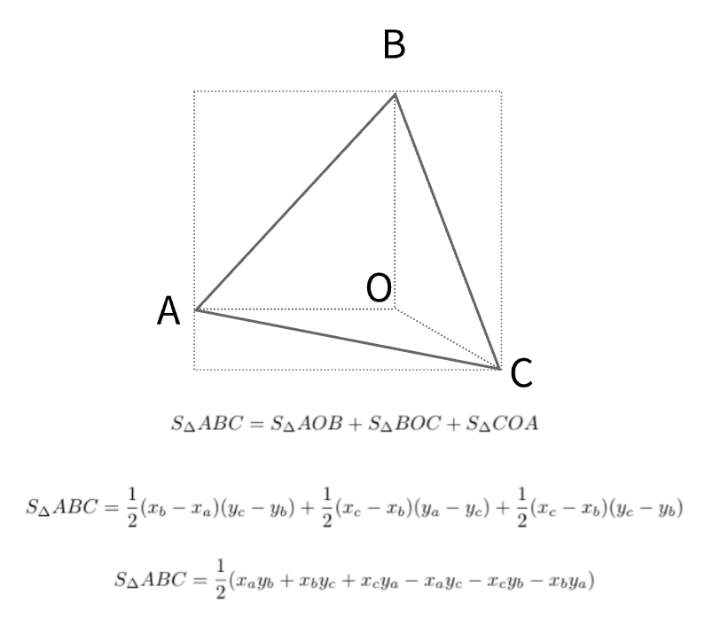

# 812. 最大三角形面积

🟢 <font color=#15bd66>Easy</font>&emsp; 🔖&ensp; [`几何`](/tag/geometry.md) [`数组`](/tag/array.md) [`数学`](/tag/math.md)&emsp; 🔗&ensp;[`力扣`](https://leetcode.cn/problems/largest-triangle-area) [`LeetCode`](https://leetcode.com/problems/largest-triangle-area)

## 题目

Given an array of points on the **X-Y** plane `points` where `points[i] = [xi,
yi]`, return _the area of the largest triangle that can be formed by any three
different points_. Answers within `10^-5` of the actual answer will be
accepted.

**Example 1:**


> Input: points = [[0,0],[0,1],[1,0],[0,2],[2,0]]
>
> Output: 2.00000
>
> Explanation: The five points are shown in the above figure. The red triangle is the largest.

**Example 2:**

> Input: points = [[1,0],[0,0],[0,1]]
>
> Output: 0.50000

**Constraints:**

- `3 <= points.length <= 50`
- `-50 <= xi, yi <= 50`
- All the given points are **unique**.

## 题目大意

给你一个由 **X-Y** 平面上的点组成的数组 `points` ，其中 `points[i] = [xi, yi]`
。从其中取任意三个不同的点组成三角形，返回能组成的最大三角形的面积。与真实值误差在 `10^-5` 内的答案将会视为正确答案**。**

**示例 1：**


> **输入：** points = [[0,0],[0,1],[1,0],[0,2],[2,0]]
>
> **输出：** 2.00000
>
> **解释：** 输入中的 5 个点如上图所示，红色的三角形面积最大。

**示例 2：**

> **输入：** points = [[1,0],[0,0],[0,1]]
>
> **输出：** 0.50000

**提示：**

- `3 <= points.length <= 50`
- `-50 <= xi, yi <= 50`
- 给出的所有点 **互不相同**

## 解题思路

这个问题要求我们计算给定一组点中，可以组成的最大三角形的面积。可以使用几何学中的 **叉积公式** 来计算三角形的面积。

1. **三角形面积的计算**：

   对于三角形 ABC，其中三个点的坐标分别为 `(Xa, Ya)`、`(Xb, Yb)` 和 `(Xc, Yc)`，三角形的面积可以使用叉积公式计算：

   

2. **遍历所有点组合**：

   - 给定 `points` 数组，包含了若干二维坐标点。要找到最大的三角形面积，需要遍历所有可能的点三元组组合，并计算这些组合所形成的三角形面积。
   - 由于输入数组的长度较小（最大为 50），因此直接用三重循环遍历所有点组合是可行的。

3. **更新最大面积**：
   - 每次计算一个三角形的面积后，更新当前的最大面积值。

#### 复杂度分析

- **时间复杂度**：`O(n^3)`，其中 `n` 是点的数量。有三重循环来遍历所有的点组合，由于题目中给定 `n <= 50`，这样复杂度是可以接受的。

- **空间复杂度**：`O(1)`，只使用了常数空间来存储中间结果。

## 代码

```javascript
/**
 * @param {number[][]} points
 * @return {number}
 */
var largestTriangleArea = function (points) {
	// 计算三角形面积的函数
	const getArea = (i, j, k) => {
		return (
			0.5 *
			Math.abs(
				i[0] * j[1] +
					j[0] * k[1] +
					k[0] * i[1] -
					j[0] * i[1] -
					k[0] * j[1] -
					i[0] * k[1]
			)
		);
	};

	const n = points.length;
	let res = 0; // 用来记录最大的三角形面积

	// 三重循环遍历所有点的三元组
	for (let i = 0; i < n; i++) {
		for (let j = i + 1; j < n; j++) {
			for (let k = j + 1; k < n; k++) {
				// 计算面积并更新最大面积
				res = Math.max(res, getArea(points[i], points[j], points[k]));
			}
		}
	}
	return res;
};
```

## 相关题目

<!-- prettier-ignore -->
| 题号 | 标题 | 题解 | 标签 | 难度 | 力扣 |
| :------: | :------ | :------: | :------ | :------: | :------: |
| 976 | 三角形的最大周长 |  |  [`贪心`](/tag/greedy.md) [`数组`](/tag/array.md) [`数学`](/tag/math.md) `1+` | 🟢 | [🀄️](https://leetcode.cn/problems/largest-perimeter-triangle) [🔗](https://leetcode.com/problems/largest-perimeter-triangle) |