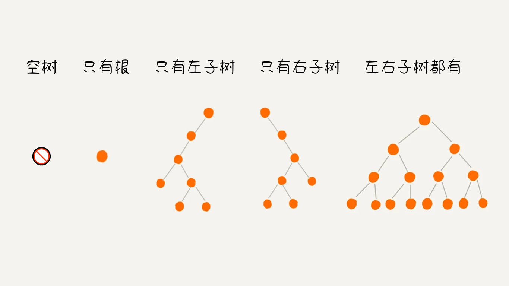
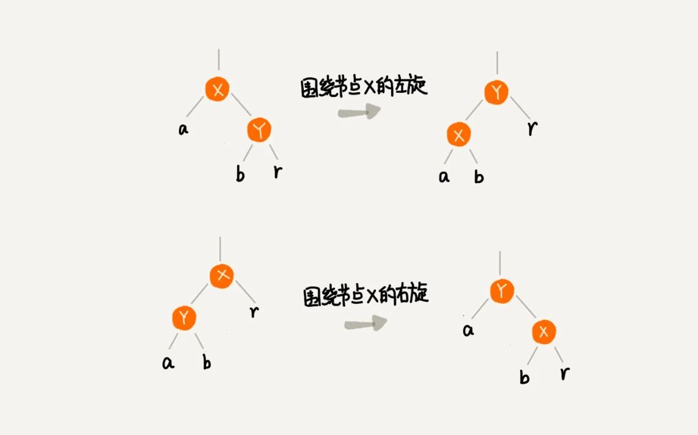

# 2.6 树

## 树的定义

::: info 定义

**树（Tree）** 是由 `n ≥ 0` 个节点与节点之间的关系组成的有限集合。当 `n = 0` 时称为空树，当 `n > 0` 时称为非空树。。

:::


“树”这种数据结构很像现实生活中的“树”，每个元素叫作“**节点**”；用来连线相邻节点之间的关系，叫作“**父子关系**”。

比如上图中的第三个树，A 节点就是 B 节点的**父节点**，B 节点是 A 节点的**子节点**。B、C、D 这三个节点的父节点是同一个节点，所以它们之间互称为**兄弟节点**。把没有父节点的节点叫作**根节点**，也就是图中的节点 E。把没有子节点的节点叫作**叶子节点**或者叶节点，比如图中的 G、H、I、J、K、L 都是叶子节点。

- **节点的高度** ：节点到叶子节点的最长路径（边数）
- **节点的深度** ：根节点到这个节点所经历的变得个数
- **节点的层数** ：节点的深度 + 1
- **节点的度**： 节点所含有的子树个数
- **树的高度**：根节点的高度


## 二叉树

::: info 定义

**二叉树（Binary Tree）** ：每个节点最多有两个子节点的树，称为二叉树。二叉树并不要求每个节点都有两个子节点，有的节点只有左子节点，有的节点只有右子节点。通常树中的分支节点被称为 「左子树」 或 「右子树」，并且两个子树是有序的，不可以互换。
:::

二叉树在逻辑上可以分为 5 种基本形态，如下图所示：



### 满二叉树

::: info 定义

**满二叉树（Full Binary Tree）** ：如果所有分支节点都存在左子树和右子树，并且所有叶子节点都在同一层上，则称该二叉树为满二叉树。
:::


### 完全二叉树

::: info 定义

**完全二叉树（Complete Binary Tree）** ：如果叶子节点只出现在最下面两层，并且最下层的叶子节点都依次排列在该层最左边的位置上，具有这种特点的二叉树称为完全二叉树。
:::


## 二叉树的存储

存储一棵二叉树有两种方法，一种是基于指针或者引用的二叉链式存储，一种是基于数组的顺序存储。

### 链式存储

链式存储中，每个节点有三个字段，其中一个存储数据，另外两个是指向左右子节点的指针。只要拎住根节点，就可以通过左右子节点的指针，把整棵树都串起来。这种存储方式比较常用。大部分二叉树代码都是通过这种结构来实现的。


### 顺序存储

顺序存储中，把根节点存储在下标 `i = 1` 的位置，左子节点存储在下标 `2 * i = 2` 的位置，右子节点存储在 `2 * i + 1 = 3` 的位置。以此类推，B 节点的左子节点存储在 `2 * i = 2 * 2 = 4` 的位置，右子节点存储在 `2 * i + 1 = 2 * 2 + 1 = 5` 的位置。


如果节点 `X` 存储在数组中下标为 `i` 的位置，下标为 `2 * i` 的位置存储的就是左子节点，下标为 `2 * i + 1` 的位置存储的就是右子节点。反过来，下标为 `i / 2` 的位置存储就是它的父节点。通过这种方式，我们只要知道根节点存储的位置（一般情况下，为了方便计算子节点，根节点会存储在下标为 `1` 的位置），这样就可以通过下标计算，把整棵树都串起来。

刚刚举的例子是一棵完全二叉树，所以仅仅“浪费”了一个下标为 `0` 的存储位置。如果是非完全二叉树，其实会浪费比较多的数组存储空间。

所以，如果某棵二叉树是一棵完全二叉树，那用数组存储无疑是最节省内存的一种方式。因为数组的存储方式并不需要像链式存储法那样，要存储额外的左右子节点的指针。这也是为什么完全二叉树会单独拎出来的原因，也是为什么完全二叉树要求最后一层的子节点都靠左的原因。

堆就是一种完全二叉树，最常用的存储方式就是数组。

## 二叉树的遍历

想要将二叉树所有节点都遍历打印出来，经典的方法有三种，前序遍历、中序遍历和后序遍历。其中，前、中、后序，表示的是节点与它的左右子树节点遍历打印的先后顺序。

- **前序遍历** 是指，对于树中的任意节点来说，先打印这个节点，然后再打印它的左子树，最后打印它的右子树。

- **中序遍历** 是指，对于树中的任意节点来说，先打印它的左子树，然后再打印它本身，最后打印它的右子树。

- **后序遍历** 是指，对于树中的任意节点来说，先打印它的左子树，然后再打印它的右子树，最后打印这个节点本身。


实际上，二叉树的前、中、后序遍历就是一个递归的过程。写递归代码的关键，就是看能不能写出递推公式，而写递推公式的关键就是，如果要解决问题 A，就假设子问题 B、C 已经解决，然后再来看如何利用 B、C 来解决 A。递推公式如下：

```javascript
// 前序遍历：
preOrder = (r) => {
  if (r == null) return;
  console.log(r);
  preOrder(r.left);
  preOrder(r.right);
};

// 中序遍历：
inOrder = (r) => {
  if (r == null) return;
  inOrder(r.left);
  console.log(r);
  inOrder(r.right);
};
// 后序遍历：
postOrder = (r) => {
  if (r == null) return;
  postOrder(r.left);
  postOrder(r.right);
  console.log(r);
};
```

二叉树的遍历中，每个节点最多会被访问两次，所以遍历操作的时间复杂度，跟节点的个数 `n` 成正比，即二叉树遍历的时间复杂度是 `O(n)` 。

### 前序遍历

:::: md-demo 相关题目

#### 📌 [144. 二叉树的前序遍历 - LeetCode](https://2xiao.github.io/leetcode-js/leetcode/problem/0144.html)

#### 💻 **题目大意**

给你二叉树的根节点 `root` ，返回它节点值的 **前序** 遍历。

**进阶**：递归算法很简单，你可以通过迭代算法完成吗？

#### 💡 **解题思路**

思路一：递归

前序遍历是指，对于树中的任意节点来说，先打印这个节点，然后再打印它的左子树，最后打印它的右子树。而在访问左子树或者右子树的时候，按照同样的方式遍历，直到遍历完整棵树。因此整个遍历过程天然具有递归的性质，可以直接用递归函数来模拟这一过程。

- 先将 `root` 节点的值加入答案
- 再递归调用 `preorderTraversal(root.left)` 来遍历 `root` 节点的左子树
- 最后递归调用 `preorderTraversal(root.right)` 来遍历 `root` 节点的右子树即可
- 递归终止的条件为碰到空节点

思路二：迭代

也可以用迭代的方式实现思路一的递归函数，两种方式是等价的，区别在于递归的时候隐式地维护了一个栈，而迭代的时候需要显式地将这个栈模拟出来，其余的实现与细节都相同，具体可以参考下面的代码。

#### 💎 **代码**

::: code-tabs
@tab 思路一：递归

```javascript
var preorderTraversal = function (root) {
  let res = [];
  if (root == null) return res;
  res.push(root.val);
  res.push(...preorderTraversal(root.left));
  res.push(...preorderTraversal(root.right));
  return res;
};
```

@tab 思路二：迭代

```javascript
var preorderTraversal = function (root) {
  let res = [];
  if (root == null) return res;
  let stack = [root];
  while (stack.length) {
    let node = stack.pop();
    res.push(node.val);
    if (node.right) stack.push(node.right);
    if (node.left) stack.push(node.left);
  }
  return res;
};
```

:::

::::

### 后序遍历

:::: md-demo 相关题目

#### 📌 [145. 二叉树的后序遍历 - LeetCode](https://2xiao.github.io/leetcode-js/leetcode/problem/0145.html)

#### 💻 **题目大意**

给你二叉树的根节点 `root` ，返回它节点值的 **后序** 遍历。

**进阶**：递归算法很简单，你可以通过迭代算法完成吗？

#### 💡 **解题思路**

思路一：递归

原理和前序遍历一样，前序遍历是中左右，后续遍历是左右中。

思路二：迭代

原理和前序遍历一样，只需要调整一下前序遍历的代码顺序，变成中右左，然后再反转 res 数组，输出的结果顺序就是左右中了。

#### 💎 **代码**

::: code-tabs
@tab 思路一：递归

```javascript
var postorderTraversal = function (root) {
  let res = [];
  if (root == null) return res;
  res.push(...postorderTraversal(root.left));
  res.push(...postorderTraversal(root.right));
  res.push(root.val);
  return res;
};
```

@tab 思路二：迭代

```javascript
var postorderTraversal = function (root) {
  let res = [];
  if (root == null) return res;
  let stack = [root];
  while (stack.length) {
    let node = stack.pop();
    res.unshift(node.val);
    if (node.left) stack.push(node.left);
    if (node.right) stack.push(node.right);
  }
  return res;
};
```

:::

::::

### 中序遍历

:::: md-demo 相关题目

#### 📌 [94. 二叉树的中序遍历 - LeetCode](https://2xiao.github.io/leetcode-js/leetcode/problem/0094.html)

#### 💻 **题目大意**

给你二叉树的根节点 `root` ，返回它节点值的 **中序** 遍历。

**进阶**：递归算法很简单，你可以通过迭代算法完成吗？

#### 💡 **解题思路**

思路一：递归

原理和前序遍历一样，前序遍历是中左右，中续遍历是左中右。

思路二：迭代

中序遍历是左中右，先访问的是二叉树顶部的节点，然后一层一层向下访问，直到到达树左面的最底部，再开始处理节点（也就是在把节点的数值放进 res 数组中），这就造成了处理顺序和访问顺序是不一致的。那么在使用迭代法写中序遍历，就需要借用指针的遍历来帮助访问节点，栈则用来处理节点上的元素。

#### 💎 **代码**

::: code-tabs
@tab 思路一：递归

```javascript
var inorderTraversal = function (root) {
  let res = [];
  if (root == null) return res;
  res.push(...inorderTraversal(root.left));
  res.push(root.val);
  res.push(...inorderTraversal(root.right));
  return res;
};
```

@tab 思路二：迭代

```javascript
var inorderTraversal = function (root) {
  let res = [];
  if (root == null) return res;
  let stack = [];
  let cur = root;
  while (cur != null || stack.length) {
    if (cur != null) {
      stack.push(cur);
      cur = cur.left;
    } else {
      cur = stack.pop();
      res.push(cur.val);
      cur = cur.right;
    }
  }
  return res;
};
```

:::

::::

### 层序遍历

:::: md-demo 相关题目

#### 📌 [102. 二叉树的层序遍历 - LeetCode](https://2xiao.github.io/leetcode-js/leetcode/problem/0102.html)

#### 💻 **题目大意**

给你二叉树的根节点 `root` ，返回它节点值的 **层序** 遍历。（即逐层地，从左到右访问所有节点）。

#### 💡 **解题思路**

思路一：广度优先遍历(BFS)

使用队列实现

1. 首先将根节点放入队列中；
2. 更新队列的长度 `len` ，遍历队列的前 `len` 个节点；
3. 如果该节点存在直接子节点，将直接子节点加入队列中，并将节点的值存入一个临时数组中；
4. 将队列的前 `len` 个节点出队，此时队列中都是下一层的子节点，将临时数组加入返回值中；
5. 重复步骤 2、3、4，直至队列为空；

思路二：深度优先遍历(DFS)

1. 维护一个递归函数，参数为节点和该节点的深度
2. 先将根节点与深度 0 传入递归函数
3. 将节点放入 index 与深度对应的数组内
4. 将节点的左子节点和右子节点分别传入递归函数，深度 +1
5. 重复步骤 3、4，直至子节点为空

#### 💎 **代码**

::: code-tabs
@tab 思路一：广度优先遍历(BFS)

```javascript
var levelOrder = function (root) {
  let res = [];
  if (root == null) return res;
  let queue = [root];

  while (queue.length) {
    let len = queue.length;
    let temp = [];
    for (let i = 0; i < len; i++) {
      if (queue[i].left) queue.push(queue[i].left);
      if (queue[i].right) queue.push(queue[i].right);
      temp.push(queue[i].val);
    }
    queue = queue.slice(len);
    res.push(temp);
  }
  return res;
};
```

@tab 思路二：深度优先遍历(DFS)

```javascript
var levelOrder = function (root) {
  let res = [];
  const traverse = (node, deep) => {
    if (node == null) return;
    if (res.length == deep) {
      res[deep] = [node.val];
    } else {
      res[deep].push(node.val);
    }
    traverse(node.left, deep + 1);
    traverse(node.right, deep + 1);
  };
  traverse(root, 0);
  return res;
};
```

:::

::::

## 二叉树的还原

二叉树的还原：指的是通过二叉树的遍历序列，还原出对应的二叉树。

单凭 前序遍历序列 或 后序遍历序列 或 中序遍历序列 是 **无法** 恢复一棵二叉树的。

但是，如果已知一棵二叉树的**前序序列和中序序列，可以唯一地确定**这棵二叉树；如果已知一棵二叉树的**中序序列和后序序列，可以唯一地确定**这棵二叉树。

需要注意的是：如果已知二叉树的**前序序列和后序序列，不能唯一地确定**一棵二叉树。这是因为没有中序遍历序列无法确定左右部分，也就无法进行子序列的分割。

二叉树的构造问题一般都是使用「分解问题」的思路：**构造整棵树 = 根节点 + 构造左子树 + 构造右子树**。

:::: md-demo 相关题目

#### 📌 [105. 从前序与中序遍历序列构造二叉树 - LeetCode](https://2xiao.github.io/leetcode-js/leetcode/problem/0105.html)

#### 💻 **题目大意**

根据一棵树的前序遍历与中序遍历构造二叉树。你可以假设树中没有重复的元素。

#### 💡 **解题思路**

构造二叉树，第一件事一定是找根节点，然后想办法构造左右子树。

前序遍历结果第一个就是根节点的值，然后再根据中序遍历结果确定左右子树的节点。


不断的递归直到所有的树都生成完成。

递归时直接传入需要的 slice 范围作为输入, 可以避免申请对应 inorder 索引的内存。

#### 💎 **代码**

```javascript
var buildTree = function (preorder, inorder) {
  if (preorder.length == 0) return null;
  let root = new TreeNode(preorder[0]);
  for (let i = 0; i < preorder.length; i++) {
    if (inorder[i] === root.val) {
      root.left = buildTree(preorder.slice(1, i + 1), inorder.slice(0, i));
      root.right = buildTree(preorder.slice(i + 1), inorder.slice(i + 1));
      break;
    }
  }
  return root;
};
```

类似的题目还有 [106. 从中序与后序遍历序列构造二叉树 - LeetCode](https://2xiao.github.io/leetcode-js/leetcode/problem/0106.html) 和 [889. 根据前序和后序遍历构造二叉树 - LeetCode](https://2xiao.github.io/leetcode-js/leetcode/problem/0889.html)，原理类似，详见题解。

::::

:::: md-demo 相关题目

#### 📌 [654. 最大二叉树 - LeetCode](https://2xiao.github.io/leetcode-js/leetcode/problem/0654.html)

#### 💻 **题目大意**

给定一个不重复的整数数组 `nums` 。 最大二叉树 可以用下面的算法从 `nums` 递归地构建:

1. 创建一个根节点，其值为 `nums` 中的最大值。
2. 递归地在最大值 左边 的 子数组前缀上 构建左子树。
3. 递归地在最大值 右边 的 子数组后缀上 构建右子树。

返回 `nums` 构建的 最大二叉树 。

**示例 1**：

```
输入：nums = [3,2,1,6,0,5]
输出：[6,3,5,null,2,0,null,null,1]
```

**解释**：递归调用如下所示：

- [3,2,1,6,0,5] 中的最大值是 6 ，左边部分是 [3,2,1] ，右边部分是 [0,5] 。
  - [3,2,1] 中的最大值是 3 ，左边部分是 [] ，右边部分是 [2,1] 。
    - 空数组，无子节点。
    - [2,1] 中的最大值是 2 ，左边部分是 [] ，右边部分是 [1] 。
      - 空数组，无子节点。
      - 只有一个元素，所以子节点是一个值为 1 的节点。
  - [0,5] 中的最大值是 5 ，左边部分是 [0] ，右边部分是 [] 。
    - 只有一个元素，所以子节点是一个值为 0 的节点。
    - 空数组，无子节点。

**示例 2**：

```
输入：nums = [3,2,1]
输出：[3,null,2,null,1]
```

#### 💡 **解题思路**

每个二叉树节点都可以认为是一棵子树的根节点，对于根节点，首先要做的当然是把想办法把自己先构造出来，然后想办法构造自己的左右子树。

所以，我们要遍历数组把找到最大值 `max`，从而把根节点 `root` 做出来，然后对 `max` 左边的数组和右边的数组进行递归构建，作为 `root` 的左右子树。

#### 💎 **代码**

```javascript
var constructMaximumBinaryTree = function (nums) {
  if (nums.length == 0) return null;
  let max = nums[0];
  let maxIndex = 0;
  for (let i = 0; i < nums.length; i++) {
    if (nums[i] > max) {
      max = nums[i];
      maxIndex = i;
    }
  }
  let root = new TreeNode(max);
  root.left = constructMaximumBinaryTree(nums.slice(0, maxIndex));
  root.right = constructMaximumBinaryTree(nums.slice(maxIndex + 1));
  return root;
};
```

::::

## 二叉查找树

::: info 定义

**二叉查找树（Binary Search Tree）** ：也叫二叉搜索树，在二叉查找树中，每个节点的左子树节点值都小于该节点的值，而右子树节点值都大于该节点的值。
:::

下图是几个二叉查找树的例子：


二叉查找树（BST）是二叉树中最常用的一种类型。二叉查找树最大的特点就是，支持动态数据集合的快速插入、删除、查找操作。在实际应用中常用于快速查找和有序插入的场景，具有良好的平均时间复杂度。

下面我们来看下，这些操作是如何实现的。

首先，我们需要定义二叉查找树的节点：

```javascript
class TreeNode {
  constructor(value) {
    this.value = value;
    this.left = null;
    this.right = null;
  }
}
```

这里，`TreeNode` 类代表了二叉查找树中的一个节点，包括节点的值、左子树和右子树。

接下来，我们创建一个 `BinarySearchTree` 类，用于实现二叉查找树的基本操作：

```javascript
class BinarySearchTree {
  constructor() {
    this.root = null;
  }
  // ...(各种操作方法)
}
```

### 1. 插入操作

插入操作是向二叉查找树中插入新值的过程，通常涉及递归，因为我们需要找到新节点应该放置的位置。以下是增加节点的原理：

1. 如果树为空（即根节点为 `null`），则新节点将成为树的根。
2. 如果树不为空，我们从树的根节点开始，比较新节点的值与当前节点的值。
   - 如果新节点的值小于当前节点的值，则递归地将新节点插入到当前节点的左子树中。
   - 如果新节点的值大于当前节点的值，则递归地将新节点插入到当前节点的右子树中。
   - 如果新节点的值等于当前节点的值，通常可以选择将新节点丢弃，或者将其放在左子树或右子树中，取决于具体的实现策略。

```javascript
class BinarySearchTree {
  // ...（之前的代码）

  insert(value) {
    this.root = this._insert(this.root, value);
  }

  _insert(node, value) {
    if (!node) {
      return new TreeNode(value);
    }

    if (value < node.value) {
      node.left = this._insert(node.left, value);
    } else if (value > node.value) {
      node.right = this._insert(node.right, value);
    }

    return node;
  }
}
```

### 2. 查找操作

查找操作是在二叉查找树中搜索特定值的过程。它是通过递归地比较节点的值和目标值来实现的。以下是查找节点的原理：

1. 从根节点开始，比较目标值与当前节点的值。

   - 如果目标值小于当前节点的值，则在左子树中继续查找。
   - 如果目标值大于当前节点的值，则在右子树中继续查找。
   - 如果目标值等于当前节点的值，找到了目标节点。

2. 重复上述步骤，直到找到目标节点或达到叶子节点（节点没有左子树和右子树）为止。

```javascript
class BinarySearchTree {
  // ...（之前的代码）

  search(value) {
    return this._search(this.root, value);
  }

  _search(node, value) {
    if (!node || node.value === value) {
      return node;
    }

    if (value < node.value) {
      return this._search(node.left, value);
    } else {
      return this._search(node.right, value);
    }
  }
}
```

这两个基本操作是二叉查找树的核心。通过递归的方式，我们能够有效地在树中进行插入和查找操作。

### 3. 删除操作

为了删除一个节点，我们需要分几种情况讨论：

1. 如果节点是叶子节点（没有左子树和右子树），直接删除即可。
2. 如果节点只有一个子节点，将该节点替换为其子节点。
3. 如果节点有两个子节点，找到右子树中的最小值节点，用该节点的值替换要删除的节点的值，然后递归地删除右子树中的最小值节点。

```javascript
class BinarySearchTree {
  // ...（之前的代码）

  delete(value) {
    this.root = this._delete(this.root, value);
  }

  _delete(node, value) {
    if (!node) {
      return null;
    }

    if (value < node.value) {
      node.left = this._delete(node.left, value);
    } else if (value > node.value) {
      node.right = this._delete(node.right, value);
    } else {
      // Node to be deleted found

      // Case 1 & 2: No child or one child
      if (!node.left) {
        return node.right;
      } else if (!node.right) {
        return node.left;
      }

      // Case 3: Two children
      const minRight = this._findMin(node.right);
      node.value = minRight.value;
      node.right = this._delete(node.right, minRight.value);
    }

    return node;
  }

  _findMin(node) {
    while (node.left) {
      node = node.left;
    }
    return node;
  }
}
```

### 4. 遍历操作

二叉查找树的遍历操作包括前序遍历、中序遍历和后序遍历，每一种遍历方式都有其特定的应用场景。

中序遍历是二叉查找树最常用的遍历方式。它按照从小到大的顺序遍历树中的节点，**输出结果是有序的，时间复杂度是 O(n)，非常高效** 。因此，二叉查找树也叫作二叉排序树。

```javascript
class BinarySearchTree {
  // ...（之前的代码）

  inOrderTraversal(callback) {
    this._inOrderTraversal(this.root, callback);
  }

  _inOrderTraversal(node, callback) {
    if (node) {
      this._inOrderTraversal(node.left, callback);
      callback(node.value);
      this._inOrderTraversal(node.right, callback);
    }
  }
}
```

遍历的时间复杂度是 `O(n)`，其中 `n` 是树中节点的数量，这是因为遍历需要访问所有节点。

::: details 👉 查看代码测试 👈

```javascript
// 创建二叉查找树
const bst = new BinarySearchTree();

// 插入节点
bst.insert(5);
bst.insert(3);
bst.insert(7);
bst.insert(2);
bst.insert(4);
bst.insert(6);
bst.insert(8);

// 查找节点
const searchResult = bst.search(4);
console.log(searchResult ? `Found: ${searchResult.value}` : "Not Found");

// 中序遍历
console.log("\nIn-order traversal:");
bst.inOrderTraversal((value) => console.log(value));

// 删除节点
bst.delete(3);

// 中序遍历查看删除后的结果
console.log("\nIn-order traversal after deletion:");
bst.inOrderTraversal((value) => console.log(value));

// 运行结果：
// Found: 4

// In-order traversal:
// 2
// 4
// 5
// 6
// 7
// 8

// In-order traversal after deletion:
// 2
// 4
// 5
// 6
// 7
// 8
```

:::

除了插入、删除、查找、遍历操作之外，二叉查找树还可以支持快速地查找最大节点和最小节点、前驱节点和后继节点。

### 复杂度分析

- 平均情况下，二叉查找树的插入、查找和删除操作的时间复杂度是 `O(log n)`。
- 最坏情况下，如果树是非平衡的，这些操作的时间复杂度会退化到 `O(n)`。
- 遍历操作的时间复杂度始终为 `O(n)`，因为需要访问所有节点。

因此，保持二叉查找树的平衡对于维护高效性能是非常重要的。平衡二叉查找树的实现（如 AVL 树或红黑树）确保了在各种操作中都能保持较小的树高度，从而提供了可靠的性能。

## 平衡二叉查找树

::: info 定义

**平衡二叉查找树（Balanced Binary Search Tree）** ：是一种特殊的二叉查找树，其所有节点满足以下平衡性质：对于树中的每个节点，其左子树和右子树的高度差不超过 `1` 。
:::


在非平衡的二叉查找树中，最坏情况下可能会导致树的高度接近线性，使得查找、插入和删除等操作的时间复杂度变为 `O(n)` 。而平衡二叉查找树能够保持较小的高度，确保这些操作的平均时间复杂度保持在 `O(log n)` 水平，提高了性能。

通过自动保持树的平衡性，确保在各种操作中具有较低的时间复杂度。常见的平衡二叉查找树实现包括 AVL 树和红黑树。

学习 AVL 树和红黑树的关键在于理解它们的平衡性质、平衡因子以及插入、删除等操作时的调整策略。

### AVL 树

AVL 树是一种自平衡二叉查找树，由两位前苏联的数学家 Adelson-Velsky 和 Landis 在 1962 年提出。AVL 树通过在每次插入或删除操作后进行旋转操作，保持了树的平衡性。

#### 平衡因子

在 AVL 树中，每个节点都有一个平衡因子（Balance Factor），定义为其左子树的高度减去右子树的高度。平衡因子的值只能是 `-1`、`0` 或 `1`。平衡因子的目标是保持所有节点的平衡因子在这个范围内。通过旋转操作，AVL 树确保所有节点的平衡因子在这个范围内，从而保持平衡。

#### 插入操作

在插入新节点时，需要逐级更新从插入点到树根的所有节点的平衡因子，并检查是否破坏了 AVL 树的平衡性。如果发现某个节点的平衡因子超出了范围，就需要通过旋转操作来修复。

#### 旋转操作

AVL 树通过四种基本的旋转操作来维护平衡：

1. **左旋（Left Rotation）：** 将一个节点的右子树提升为新的根，原根成为新根的左子树。
2. **右旋（Right Rotation）：** 将一个节点的左子树提升为新的根，原根成为新根的右子树。
3. **左-右旋转（Left-Right Rotation）：** 先对左子树进行左旋，然后再对根节点进行右旋。
4. **右-左旋转（Right-Left Rotation）：** 先对右子树进行右旋，然后再对根节点进行左旋。

通过这些旋转操作，AVL 树能够在插入节点后保持平衡。

### 红黑树

红黑树（Red-Black Tree）简称 R-B Tree，是另一种自平衡二叉查找树，它引入了颜色标记来确保平衡性，每个节点都被标记为红色或黑色。红黑树的平衡性质主要通过以下几点来维护：

1. **根节点是黑色的。**
2. **所有叶子节点（NIL 节点）都是黑色的。**
3. **如果一个节点是红色的，则它的两个子节点都是黑色的。**
4. **从任意节点到其每个叶子的路径都包含相同数量的黑色节点。**


#### 插入操作

在红黑树中，插入节点时，首先按照二叉查找树的方式插入节点，然后通过一系列的颜色调整和旋转来保持红黑树的性质。

#### 旋转操作

红黑树的旋转操作包括左旋和右旋，与 AVL 树相似。旋转操作的目的是通过重新组织树的结构来保持平衡性。



红黑树相对于 AVL 树的优势在于，由于不需要保持严格的平衡，红黑树的旋转操作较少，插入和删除节点时的性能更为稳定。

红黑树的高度近似 `2log n`，所以它是近似平衡，插入、删除、查找操作的时间复杂度都是 `O(log n)`。

## 递归树


<!-- START TABLE -->
<!-- Please keep comment here to allow auto update -->
<!-- DON'T EDIT THIS SECTION, INSTEAD RE-RUN `npm run lc` TO UPDATE -->


## 相关题目

#### 二叉树的遍历

| 题号 | 标题 | 题解 | 标签 | 难度 |
| :------: | :------ | :------: | :------ | :------ |
| 0144 | [二叉树的前序遍历](https://leetcode.com/problems/binary-tree-preorder-traversal/) | [JS](https://2xiao.github.io/leetcode-js/leetcode/problem/0144) |  [`栈`](/leetcode/outline/tag/stack.md) [`树`](/leetcode/outline/tag/tree.md) [`深度优先搜索`](/leetcode/outline/tag/depth-first-search.md) `1+` | <font color=#15bd66>Esay</font> |
| 0094 | [二叉树的中序遍历](https://leetcode.com/problems/binary-tree-inorder-traversal/) | [JS](https://2xiao.github.io/leetcode-js/leetcode/problem/0094) |  [`栈`](/leetcode/outline/tag/stack.md) [`树`](/leetcode/outline/tag/tree.md) [`深度优先搜索`](/leetcode/outline/tag/depth-first-search.md) `1+` | <font color=#15bd66>Esay</font> |
| 0145 | [二叉树的后序遍历](https://leetcode.com/problems/binary-tree-postorder-traversal/) | [JS](https://2xiao.github.io/leetcode-js/leetcode/problem/0145) |  [`栈`](/leetcode/outline/tag/stack.md) [`树`](/leetcode/outline/tag/tree.md) [`深度优先搜索`](/leetcode/outline/tag/depth-first-search.md) `1+` | <font color=#15bd66>Esay</font> |
| 0102 | [二叉树的层序遍历](https://leetcode.com/problems/binary-tree-level-order-traversal/) | [JS](https://2xiao.github.io/leetcode-js/leetcode/problem/0102) |  [`树`](/leetcode/outline/tag/tree.md) [`广度优先搜索`](/leetcode/outline/tag/breadth-first-search.md) [`二叉树`](/leetcode/outline/tag/binary-tree.md) | <font color=#ffb800>Medium</font> |
| 0103 | [二叉树的锯齿形层序遍历](https://leetcode.com/problems/binary-tree-zigzag-level-order-traversal/) | [JS](https://2xiao.github.io/leetcode-js/leetcode/problem/0103) |  [`树`](/leetcode/outline/tag/tree.md) [`广度优先搜索`](/leetcode/outline/tag/breadth-first-search.md) [`二叉树`](/leetcode/outline/tag/binary-tree.md) | <font color=#ffb800>Medium</font> |
| 0107 | [二叉树的层序遍历 II](https://leetcode.com/problems/binary-tree-level-order-traversal-ii/) | [JS](https://2xiao.github.io/leetcode-js/leetcode/problem/0107) |  [`树`](/leetcode/outline/tag/tree.md) [`广度优先搜索`](/leetcode/outline/tag/breadth-first-search.md) [`二叉树`](/leetcode/outline/tag/binary-tree.md) | <font color=#ffb800>Medium</font> |
| 0104 | [二叉树的最大深度](https://leetcode.com/problems/maximum-depth-of-binary-tree/) | [JS](https://2xiao.github.io/leetcode-js/leetcode/problem/0104) |  [`树`](/leetcode/outline/tag/tree.md) [`深度优先搜索`](/leetcode/outline/tag/depth-first-search.md) [`广度优先搜索`](/leetcode/outline/tag/breadth-first-search.md) `1+` | <font color=#15bd66>Esay</font> |
| 0111 | [二叉树的最小深度](https://leetcode.com/problems/minimum-depth-of-binary-tree/) | [JS](https://2xiao.github.io/leetcode-js/leetcode/problem/0111) |  [`树`](/leetcode/outline/tag/tree.md) [`深度优先搜索`](/leetcode/outline/tag/depth-first-search.md) [`广度优先搜索`](/leetcode/outline/tag/breadth-first-search.md) `1+` | <font color=#15bd66>Esay</font> |
| 0124 | [二叉树中的最大路径和](https://leetcode.com/problems/binary-tree-maximum-path-sum/) |  |  [`树`](/leetcode/outline/tag/tree.md) [`深度优先搜索`](/leetcode/outline/tag/depth-first-search.md) [`动态规划`](/leetcode/outline/tag/dynamic-programming.md) `1+` | <font color=#ff334b>Hard</font> |
| 0101 | [对称二叉树](https://leetcode.com/problems/symmetric-tree/) | [JS](https://2xiao.github.io/leetcode-js/leetcode/problem/0101) |  [`树`](/leetcode/outline/tag/tree.md) [`深度优先搜索`](/leetcode/outline/tag/depth-first-search.md) [`广度优先搜索`](/leetcode/outline/tag/breadth-first-search.md) `1+` | <font color=#15bd66>Esay</font> |
| 0112 | [路径总和](https://leetcode.com/problems/path-sum/) | [JS](https://2xiao.github.io/leetcode-js/leetcode/problem/0112) |  [`树`](/leetcode/outline/tag/tree.md) [`深度优先搜索`](/leetcode/outline/tag/depth-first-search.md) [`广度优先搜索`](/leetcode/outline/tag/breadth-first-search.md) `1+` | <font color=#15bd66>Esay</font> |
| 0113 | [路径总和 II](https://leetcode.com/problems/path-sum-ii/) | [JS](https://2xiao.github.io/leetcode-js/leetcode/problem/0113) |  [`树`](/leetcode/outline/tag/tree.md) [`深度优先搜索`](/leetcode/outline/tag/depth-first-search.md) [`回溯`](/leetcode/outline/tag/backtracking.md) `1+` | <font color=#ffb800>Medium</font> |
| 0236 | [二叉树的最近公共祖先](https://leetcode.com/problems/lowest-common-ancestor-of-a-binary-tree/) | [JS](https://2xiao.github.io/leetcode-js/leetcode/problem/0236) |  [`树`](/leetcode/outline/tag/tree.md) [`深度优先搜索`](/leetcode/outline/tag/depth-first-search.md) [`二叉树`](/leetcode/outline/tag/binary-tree.md) | <font color=#ffb800>Medium</font> |
| 0199 | [二叉树的右视图](https://leetcode.com/problems/binary-tree-right-side-view/) | [JS](https://2xiao.github.io/leetcode-js/leetcode/problem/0199) |  [`树`](/leetcode/outline/tag/tree.md) [`深度优先搜索`](/leetcode/outline/tag/depth-first-search.md) [`广度优先搜索`](/leetcode/outline/tag/breadth-first-search.md) `1+` | <font color=#ffb800>Medium</font> |
| 0226 | [翻转二叉树](https://leetcode.com/problems/invert-binary-tree/) | [JS](https://2xiao.github.io/leetcode-js/leetcode/problem/0226) |  [`树`](/leetcode/outline/tag/tree.md) [`深度优先搜索`](/leetcode/outline/tag/depth-first-search.md) [`广度优先搜索`](/leetcode/outline/tag/breadth-first-search.md) `1+` | <font color=#15bd66>Esay</font> |
| 0958 | [二叉树的完全性检验](https://leetcode.com/problems/check-completeness-of-a-binary-tree/) | [JS](https://2xiao.github.io/leetcode-js/leetcode/problem/0958) |  [`树`](/leetcode/outline/tag/tree.md) [`广度优先搜索`](/leetcode/outline/tag/breadth-first-search.md) [`二叉树`](/leetcode/outline/tag/binary-tree.md) | <font color=#ffb800>Medium</font> |
| 0572 | [另一棵树的子树](https://leetcode.com/problems/subtree-of-another-tree/) | [JS](https://2xiao.github.io/leetcode-js/leetcode/problem/0572) |  [`树`](/leetcode/outline/tag/tree.md) [`深度优先搜索`](/leetcode/outline/tag/depth-first-search.md) [`二叉树`](/leetcode/outline/tag/binary-tree.md) `2+` | <font color=#15bd66>Esay</font> |
| 0100 | [相同的树](https://leetcode.com/problems/same-tree/) | [JS](https://2xiao.github.io/leetcode-js/leetcode/problem/0100) |  [`树`](/leetcode/outline/tag/tree.md) [`深度优先搜索`](/leetcode/outline/tag/depth-first-search.md) [`广度优先搜索`](/leetcode/outline/tag/breadth-first-search.md) `1+` | <font color=#15bd66>Esay</font> |
| 0116 | [填充每个节点的下一个右侧节点指针](https://leetcode.com/problems/populating-next-right-pointers-in-each-node/) | [JS](https://2xiao.github.io/leetcode-js/leetcode/problem/0116) |  [`树`](/leetcode/outline/tag/tree.md) [`深度优先搜索`](/leetcode/outline/tag/depth-first-search.md) [`广度优先搜索`](/leetcode/outline/tag/breadth-first-search.md) `2+` | <font color=#ffb800>Medium</font> |
| 0117 | [填充每个节点的下一个右侧节点指针 II](https://leetcode.com/problems/populating-next-right-pointers-in-each-node-ii/) | [JS](https://2xiao.github.io/leetcode-js/leetcode/problem/0117) |  [`树`](/leetcode/outline/tag/tree.md) [`深度优先搜索`](/leetcode/outline/tag/depth-first-search.md) [`广度优先搜索`](/leetcode/outline/tag/breadth-first-search.md) `2+` | <font color=#ffb800>Medium</font> |
| 0297 | [二叉树的序列化与反序列化](https://leetcode.com/problems/serialize-and-deserialize-binary-tree/) | [JS](https://2xiao.github.io/leetcode-js/leetcode/problem/0297) |  [`树`](/leetcode/outline/tag/tree.md) [`深度优先搜索`](/leetcode/outline/tag/depth-first-search.md) [`广度优先搜索`](/leetcode/outline/tag/breadth-first-search.md) `3+` | <font color=#ff334b>Hard</font> |
| 0114 | [二叉树展开为链表](https://leetcode.com/problems/flatten-binary-tree-to-linked-list/) | [JS](https://2xiao.github.io/leetcode-js/leetcode/problem/0114) |  [`栈`](/leetcode/outline/tag/stack.md) [`树`](/leetcode/outline/tag/tree.md) [`深度优先搜索`](/leetcode/outline/tag/depth-first-search.md) `2+` | <font color=#ffb800>Medium</font> |

#### 二叉树的还原

| 题号 | 标题 | 题解 | 标签 | 难度 |
| :------: | :------ | :------: | :------ | :------ |
| 0105 | [从前序与中序遍历序列构造二叉树](https://leetcode.com/problems/construct-binary-tree-from-preorder-and-inorder-traversal/) | [JS](https://2xiao.github.io/leetcode-js/leetcode/problem/0105) |  [`树`](/leetcode/outline/tag/tree.md) [`数组`](/leetcode/outline/tag/array.md) [`哈希表`](/leetcode/outline/tag/hash-table.md) `2+` | <font color=#ffb800>Medium</font> |
| 0106 | [从中序与后序遍历序列构造二叉树](https://leetcode.com/problems/construct-binary-tree-from-inorder-and-postorder-traversal/) | [JS](https://2xiao.github.io/leetcode-js/leetcode/problem/0106) |  [`树`](/leetcode/outline/tag/tree.md) [`数组`](/leetcode/outline/tag/array.md) [`哈希表`](/leetcode/outline/tag/hash-table.md) `2+` | <font color=#ffb800>Medium</font> |
| 0889 | [根据前序和后序遍历构造二叉树](https://leetcode.com/problems/construct-binary-tree-from-preorder-and-postorder-traversal/) | [JS](https://2xiao.github.io/leetcode-js/leetcode/problem/0889) |  [`树`](/leetcode/outline/tag/tree.md) [`数组`](/leetcode/outline/tag/array.md) [`哈希表`](/leetcode/outline/tag/hash-table.md) `2+` | <font color=#ffb800>Medium</font> |

#### 二叉搜索树

| 题号 | 标题 | 题解 | 标签 | 难度 |
| :------: | :------ | :------: | :------ | :------ |
| 0098 | [验证二叉搜索树](https://leetcode.com/problems/validate-binary-search-tree/) | [JS](https://2xiao.github.io/leetcode-js/leetcode/problem/0098) |  [`树`](/leetcode/outline/tag/tree.md) [`深度优先搜索`](/leetcode/outline/tag/depth-first-search.md) [`二叉搜索树`](/leetcode/outline/tag/binary-search-tree.md) `1+` | <font color=#ffb800>Medium</font> |
| 0173 | [二叉搜索树迭代器](https://leetcode.com/problems/binary-search-tree-iterator/) | [JS](https://2xiao.github.io/leetcode-js/leetcode/problem/0173) |  [`栈`](/leetcode/outline/tag/stack.md) [`树`](/leetcode/outline/tag/tree.md) [`设计`](/leetcode/outline/tag/design.md) `3+` | <font color=#ffb800>Medium</font> |
| 0700 | [二叉搜索树中的搜索](https://leetcode.com/problems/search-in-a-binary-search-tree/) | [JS](https://2xiao.github.io/leetcode-js/leetcode/problem/0700) |  [`树`](/leetcode/outline/tag/tree.md) [`二叉搜索树`](/leetcode/outline/tag/binary-search-tree.md) [`二叉树`](/leetcode/outline/tag/binary-tree.md) | <font color=#15bd66>Esay</font> |
| 0701 | [二叉搜索树中的插入操作](https://leetcode.com/problems/insert-into-a-binary-search-tree/) | [JS](https://2xiao.github.io/leetcode-js/leetcode/problem/0701) |  [`树`](/leetcode/outline/tag/tree.md) [`二叉搜索树`](/leetcode/outline/tag/binary-search-tree.md) [`二叉树`](/leetcode/outline/tag/binary-tree.md) | <font color=#ffb800>Medium</font> |
| 0450 | [删除二叉搜索树中的节点](https://leetcode.com/problems/delete-node-in-a-bst/) | [JS](https://2xiao.github.io/leetcode-js/leetcode/problem/0450) |  [`树`](/leetcode/outline/tag/tree.md) [`二叉搜索树`](/leetcode/outline/tag/binary-search-tree.md) [`二叉树`](/leetcode/outline/tag/binary-tree.md) | <font color=#ffb800>Medium</font> |
| 0703 | [数据流中的第 K 大元素](https://leetcode.com/problems/kth-largest-element-in-a-stream/) |  |  [`树`](/leetcode/outline/tag/tree.md) [`设计`](/leetcode/outline/tag/design.md) [`二叉搜索树`](/leetcode/outline/tag/binary-search-tree.md) `3+` | <font color=#15bd66>Esay</font> |
| 剑指 Offer 54 | [二叉搜索树的第k大节点](https://leetcode.cn/problems/er-cha-sou-suo-shu-de-di-kda-jie-dian-lcof/) | [JS](https://2xiao.github.io/leetcode-js/leetcode/problem/jz_offer_54_1) |  [`树`](/leetcode/outline/tag/tree.md) [`深度优先搜索`](/leetcode/outline/tag/depth-first-search.md) [`二叉搜索树`](/leetcode/outline/tag/binary-search-tree.md) `1+` | <font color=#15bd66>Esay</font> |
| 0230 | [二叉搜索树中第K小的元素](https://leetcode.com/problems/kth-smallest-element-in-a-bst/) | [JS](https://2xiao.github.io/leetcode-js/leetcode/problem/0230) |  [`树`](/leetcode/outline/tag/tree.md) [`深度优先搜索`](/leetcode/outline/tag/depth-first-search.md) [`二叉搜索树`](/leetcode/outline/tag/binary-search-tree.md) `1+` | <font color=#ffb800>Medium</font> |
| 0235 | [二叉搜索树的最近公共祖先](https://leetcode.com/problems/lowest-common-ancestor-of-a-binary-search-tree/) | [JS](https://2xiao.github.io/leetcode-js/leetcode/problem/0235) |  [`树`](/leetcode/outline/tag/tree.md) [`深度优先搜索`](/leetcode/outline/tag/depth-first-search.md) [`二叉搜索树`](/leetcode/outline/tag/binary-search-tree.md) `1+` | <font color=#ffb800>Medium</font> |
| 0426 | [将二叉搜索树转化为排序的双向链表](https://leetcode.com/problems/convert-binary-search-tree-to-sorted-doubly-linked-list/) | [JS](https://2xiao.github.io/leetcode-js/leetcode/problem/0426) |  [`栈`](/leetcode/outline/tag/stack.md) [`树`](/leetcode/outline/tag/tree.md) [`深度优先搜索`](/leetcode/outline/tag/depth-first-search.md) `4+` | <font color=#ffb800>Medium</font> |
| 0108 | [将有序数组转换为二叉搜索树](https://leetcode.com/problems/convert-sorted-array-to-binary-search-tree/) | [JS](https://2xiao.github.io/leetcode-js/leetcode/problem/0108) |  [`树`](/leetcode/outline/tag/tree.md) [`二叉搜索树`](/leetcode/outline/tag/binary-search-tree.md) [`数组`](/leetcode/outline/tag/array.md) `2+` | <font color=#15bd66>Esay</font> |
| 0110 | [平衡二叉树](https://leetcode.com/problems/balanced-binary-tree/) | [JS](https://2xiao.github.io/leetcode-js/leetcode/problem/0110) |  [`树`](/leetcode/outline/tag/tree.md) [`深度优先搜索`](/leetcode/outline/tag/depth-first-search.md) [`二叉树`](/leetcode/outline/tag/binary-tree.md) | <font color=#15bd66>Esay</font> |

#### 线段树

* 单点更新

| 题号 | 标题 | 题解 | 标签 | 难度 |
| :------: | :------ | :------: | :------ | :------ |
| 0303 | [区域和检索 - 数组不可变](https://leetcode.com/problems/range-sum-query-immutable/) |  |  [`设计`](/leetcode/outline/tag/design.md) [`数组`](/leetcode/outline/tag/array.md) [`前缀和`](/leetcode/outline/tag/prefix-sum.md) | <font color=#15bd66>Esay</font> |
| 0307 | [区域和检索 - 数组可修改](https://leetcode.com/problems/range-sum-query-mutable/) |  |  [`设计`](/leetcode/outline/tag/design.md) [`树状数组`](/leetcode/outline/tag/fenwick-tree.md) [`线段树`](/leetcode/outline/tag/segment-tree.md) `1+` | <font color=#ffb800>Medium</font> |
| 0354 | [俄罗斯套娃信封问题](https://leetcode.com/problems/russian-doll-envelopes/) |  |  [`数组`](/leetcode/outline/tag/array.md) [`二分查找`](/leetcode/outline/tag/binary-search.md) [`动态规划`](/leetcode/outline/tag/dynamic-programming.md) `1+` | <font color=#ff334b>Hard</font> |

* 区间更新

| 题号 | 标题 | 题解 | 标签 | 难度 |
| :------: | :------ | :------: | :------ | :------ |
| 0370 | [区间加法](https://leetcode.com/problems/range-addition/) |  |  [`数组`](/leetcode/outline/tag/array.md) [`前缀和`](/leetcode/outline/tag/prefix-sum.md) | <font color=#ffb800>Medium</font> |
| 1109 | [航班预订统计](https://leetcode.com/problems/corporate-flight-bookings/) |  |  [`数组`](/leetcode/outline/tag/array.md) [`前缀和`](/leetcode/outline/tag/prefix-sum.md) | <font color=#ffb800>Medium</font> |
| 1450 | [在既定时间做作业的学生人数](https://leetcode.com/problems/number-of-students-doing-homework-at-a-given-time/) |  |  [`数组`](/leetcode/outline/tag/array.md) | <font color=#15bd66>Esay</font> |
| 0673 | [最长递增子序列的个数](https://leetcode.com/problems/number-of-longest-increasing-subsequence/) |  |  [`树状数组`](/leetcode/outline/tag/fenwick-tree.md) [`线段树`](/leetcode/outline/tag/segment-tree.md) [`数组`](/leetcode/outline/tag/array.md) `1+` | <font color=#ffb800>Medium</font> |
| 1310 | [子数组异或查询](https://leetcode.com/problems/xor-queries-of-a-subarray/) |  |  [`位运算`](/leetcode/outline/tag/bit-manipulation.md) [`数组`](/leetcode/outline/tag/array.md) [`前缀和`](/leetcode/outline/tag/prefix-sum.md) | <font color=#ffb800>Medium</font> |
| 1851 | [包含每个查询的最小区间](https://leetcode.com/problems/minimum-interval-to-include-each-query/) |  |  [`数组`](/leetcode/outline/tag/array.md) [`二分查找`](/leetcode/outline/tag/binary-search.md) [`排序`](/leetcode/outline/tag/sorting.md) `2+` | <font color=#ff334b>Hard</font> |

* 区间合并

| 题号 | 标题 | 题解 | 标签 | 难度 |
| :------: | :------ | :------: | :------ | :------ |
| 0729 | [我的日程安排表 I](https://leetcode.com/problems/my-calendar-i/) |  |  [`设计`](/leetcode/outline/tag/design.md) [`线段树`](/leetcode/outline/tag/segment-tree.md) [`二分查找`](/leetcode/outline/tag/binary-search.md) `1+` | <font color=#ffb800>Medium</font> |
| 0731 | [我的日程安排表 II](https://leetcode.com/problems/my-calendar-ii/) |  |  [`设计`](/leetcode/outline/tag/design.md) [`线段树`](/leetcode/outline/tag/segment-tree.md) [`二分查找`](/leetcode/outline/tag/binary-search.md) `1+` | <font color=#ffb800>Medium</font> |
| 0732 | [我的日程安排表 III](https://leetcode.com/problems/my-calendar-iii/) |  |  [`设计`](/leetcode/outline/tag/design.md) [`线段树`](/leetcode/outline/tag/segment-tree.md) [`二分查找`](/leetcode/outline/tag/binary-search.md) `1+` | <font color=#ff334b>Hard</font> |

* 扫描线问题

| 题号 | 标题 | 题解 | 标签 | 难度 |
| :------: | :------ | :------: | :------ | :------ |
| 0218 | [天际线问题](https://leetcode.com/problems/the-skyline-problem/) |  |  [`树状数组`](/leetcode/outline/tag/fenwick-tree.md) [`线段树`](/leetcode/outline/tag/segment-tree.md) [`数组`](/leetcode/outline/tag/array.md) `4+` | <font color=#ff334b>Hard</font> |
| 0391 | [完美矩形](https://leetcode.com/problems/perfect-rectangle/) |  |  [`数组`](/leetcode/outline/tag/array.md) [`扫描线`](/leetcode/outline/tag/sweep-line.md) | <font color=#ff334b>Hard</font> |
| 0850 | [矩形面积 II](https://leetcode.com/problems/rectangle-area-ii/) |  |  [`线段树`](/leetcode/outline/tag/segment-tree.md) [`数组`](/leetcode/outline/tag/array.md) [`有序集合`](/leetcode/outline/tag/ordered-set.md) `1+` | <font color=#ff334b>Hard</font> |

#### 树状数组

| 题号 | 标题 | 题解 | 标签 | 难度 |
| :------: | :------ | :------: | :------ | :------ |
| 0303 | [区域和检索 - 数组不可变](https://leetcode.com/problems/range-sum-query-immutable/) |  |  [`设计`](/leetcode/outline/tag/design.md) [`数组`](/leetcode/outline/tag/array.md) [`前缀和`](/leetcode/outline/tag/prefix-sum.md) | <font color=#15bd66>Esay</font> |
| 0307 | [区域和检索 - 数组可修改](https://leetcode.com/problems/range-sum-query-mutable/) |  |  [`设计`](/leetcode/outline/tag/design.md) [`树状数组`](/leetcode/outline/tag/fenwick-tree.md) [`线段树`](/leetcode/outline/tag/segment-tree.md) `1+` | <font color=#ffb800>Medium</font> |
| 0315 | [计算右侧小于当前元素的个数](https://leetcode.com/problems/count-of-smaller-numbers-after-self/) |  |  [`树状数组`](/leetcode/outline/tag/fenwick-tree.md) [`线段树`](/leetcode/outline/tag/segment-tree.md) [`数组`](/leetcode/outline/tag/array.md) `4+` | <font color=#ff334b>Hard</font> |
| 1450 | [在既定时间做作业的学生人数](https://leetcode.com/problems/number-of-students-doing-homework-at-a-given-time/) |  |  [`数组`](/leetcode/outline/tag/array.md) | <font color=#15bd66>Esay</font> |
| 0354 | [俄罗斯套娃信封问题](https://leetcode.com/problems/russian-doll-envelopes/) |  |  [`数组`](/leetcode/outline/tag/array.md) [`二分查找`](/leetcode/outline/tag/binary-search.md) [`动态规划`](/leetcode/outline/tag/dynamic-programming.md) `1+` | <font color=#ff334b>Hard</font> |
| 0673 | [最长递增子序列的个数](https://leetcode.com/problems/number-of-longest-increasing-subsequence/) |  |  [`树状数组`](/leetcode/outline/tag/fenwick-tree.md) [`线段树`](/leetcode/outline/tag/segment-tree.md) [`数组`](/leetcode/outline/tag/array.md) `1+` | <font color=#ffb800>Medium</font> |
| 1310 | [子数组异或查询](https://leetcode.com/problems/xor-queries-of-a-subarray/) |  |  [`位运算`](/leetcode/outline/tag/bit-manipulation.md) [`数组`](/leetcode/outline/tag/array.md) [`前缀和`](/leetcode/outline/tag/prefix-sum.md) | <font color=#ffb800>Medium</font> |
| 1893 | [检查是否区域内所有整数都被覆盖](https://leetcode.com/problems/check-if-all-the-integers-in-a-range-are-covered/) |  |  [`数组`](/leetcode/outline/tag/array.md) [`哈希表`](/leetcode/outline/tag/hash-table.md) [`前缀和`](/leetcode/outline/tag/prefix-sum.md) | <font color=#15bd66>Esay</font> |

#### 并查集

| 题号 | 标题 | 题解 | 标签 | 难度 |
| :------: | :------ | :------: | :------ | :------ |
| 0990 | [等式方程的可满足性](https://leetcode.com/problems/satisfiability-of-equality-equations/) |  |  [`并查集`](/leetcode/outline/tag/disjoint-set-union.md) [`图`](/leetcode/outline/tag/graph.md) [`数组`](/leetcode/outline/tag/array.md) `1+` | <font color=#ffb800>Medium</font> |
| 0547 | [省份数量](https://leetcode.com/problems/number-of-provinces/) |  |  [`深度优先搜索`](/leetcode/outline/tag/depth-first-search.md) [`广度优先搜索`](/leetcode/outline/tag/breadth-first-search.md) [`并查集`](/leetcode/outline/tag/disjoint-set-union.md) `1+` | <font color=#ffb800>Medium</font> |
| 0684 | [冗余连接](https://leetcode.com/problems/redundant-connection/) |  |  [`深度优先搜索`](/leetcode/outline/tag/depth-first-search.md) [`广度优先搜索`](/leetcode/outline/tag/breadth-first-search.md) [`并查集`](/leetcode/outline/tag/disjoint-set-union.md) `1+` | <font color=#ffb800>Medium</font> |
| 1319 | [连通网络的操作次数](https://leetcode.com/problems/number-of-operations-to-make-network-connected/) |  |  [`深度优先搜索`](/leetcode/outline/tag/depth-first-search.md) [`广度优先搜索`](/leetcode/outline/tag/breadth-first-search.md) [`并查集`](/leetcode/outline/tag/disjoint-set-union.md) `1+` | <font color=#ffb800>Medium</font> |
| 0765 | [情侣牵手](https://leetcode.com/problems/couples-holding-hands/) |  |  [`贪心`](/leetcode/outline/tag/greedy.md) [`深度优先搜索`](/leetcode/outline/tag/depth-first-search.md) [`广度优先搜索`](/leetcode/outline/tag/breadth-first-search.md) `2+` | <font color=#ff334b>Hard</font> |
| 0399 | [除法求值](https://leetcode.com/problems/evaluate-division/) |  |  [`深度优先搜索`](/leetcode/outline/tag/depth-first-search.md) [`广度优先搜索`](/leetcode/outline/tag/breadth-first-search.md) [`并查集`](/leetcode/outline/tag/disjoint-set-union.md) `3+` | <font color=#ffb800>Medium</font> |
| 0959 | [由斜杠划分区域](https://leetcode.com/problems/regions-cut-by-slashes/) |  |  [`深度优先搜索`](/leetcode/outline/tag/depth-first-search.md) [`广度优先搜索`](/leetcode/outline/tag/breadth-first-search.md) [`并查集`](/leetcode/outline/tag/disjoint-set-union.md) `1+` | <font color=#ffb800>Medium</font> |
| 1631 | [最小体力消耗路径](https://leetcode.com/problems/path-with-minimum-effort/) |  |  [`深度优先搜索`](/leetcode/outline/tag/depth-first-search.md) [`广度优先搜索`](/leetcode/outline/tag/breadth-first-search.md) [`并查集`](/leetcode/outline/tag/disjoint-set-union.md) `4+` | <font color=#ffb800>Medium</font> |
| 0778 | [水位上升的泳池中游泳](https://leetcode.com/problems/swim-in-rising-water/) |  |  [`深度优先搜索`](/leetcode/outline/tag/depth-first-search.md) [`广度优先搜索`](/leetcode/outline/tag/breadth-first-search.md) [`并查集`](/leetcode/outline/tag/disjoint-set-union.md) `4+` | <font color=#ff334b>Hard</font> |
| 1202 | [交换字符串中的元素](https://leetcode.com/problems/smallest-string-with-swaps/) |  |  [`深度优先搜索`](/leetcode/outline/tag/depth-first-search.md) [`广度优先搜索`](/leetcode/outline/tag/breadth-first-search.md) [`并查集`](/leetcode/outline/tag/disjoint-set-union.md) `2+` | <font color=#ffb800>Medium</font> |
| 0947 | [移除最多的同行或同列石头](https://leetcode.com/problems/most-stones-removed-with-same-row-or-column/) |  |  [`深度优先搜索`](/leetcode/outline/tag/depth-first-search.md) [`并查集`](/leetcode/outline/tag/disjoint-set-union.md) [`图`](/leetcode/outline/tag/graph.md) | <font color=#ffb800>Medium</font> |
| 0803 | [打砖块](https://leetcode.com/problems/bricks-falling-when-hit/) |  |  [`并查集`](/leetcode/outline/tag/disjoint-set-union.md) [`数组`](/leetcode/outline/tag/array.md) [`矩阵`](/leetcode/outline/tag/matrix.md) | <font color=#ff334b>Hard</font> |
| 0128 | [最长连续序列](https://leetcode.com/problems/longest-consecutive-sequence/) | [JS](https://2xiao.github.io/leetcode-js/leetcode/problem/0128) |  [`并查集`](/leetcode/outline/tag/disjoint-set-union.md) [`数组`](/leetcode/outline/tag/array.md) [`哈希表`](/leetcode/outline/tag/hash-table.md) | <font color=#ffb800>Medium</font> |

