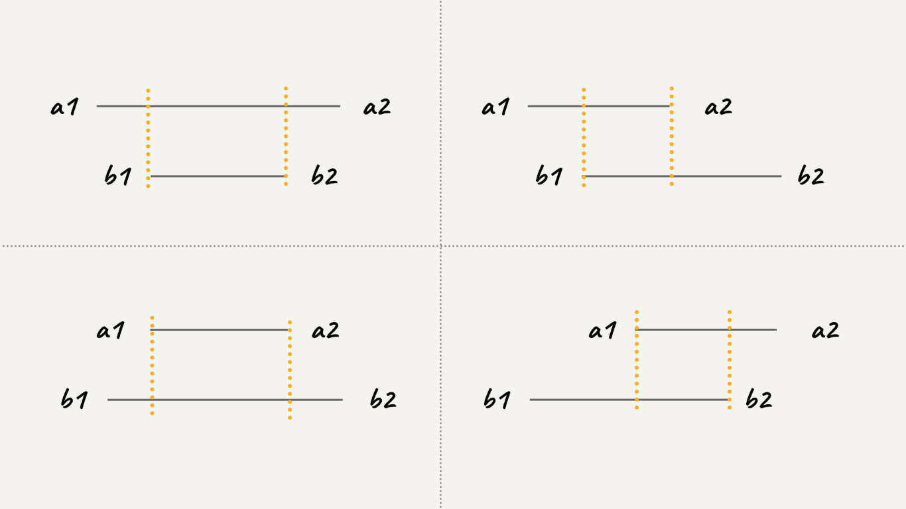

# [986. 区间列表的交集](https://2xiao.github.io/leetcode-js/problem/0986.html)

🟠 <font color=#ffb800>Medium</font>&emsp; 🔖&ensp; [`数组`](/tag/array.md) [`双指针`](/tag/two-pointers.md)&emsp; 🔗&ensp;[`力扣`](https://leetcode.cn/problems/interval-list-intersections) [`LeetCode`](https://leetcode.com/problems/interval-list-intersections)

## 题目

You are given two lists of closed intervals, `firstList` and `secondList`,
where `firstList[i] = [starti, endi]` and `secondList[j] = [startj, endj]`.
Each list of intervals is pairwise **disjoint** and in **sorted order**.

Return _the intersection of these two interval lists_.

A **closed interval** `[a, b]` (with `a <= b`) denotes the set of real numbers
`x` with `a <= x <= b`.

The **intersection** of two closed intervals is a set of real numbers that are
either empty or represented as a closed interval. For example, the
intersection of `[1, 3]` and `[2, 4]` is `[2, 3]`.

**Example 1:**


> Input: firstList = [[0,2],[5,10],[13,23],[24,25]], secondList = [[1,5],[8,12],[15,24],[25,26]]
>
> Output: [[1,2],[5,5],[8,10],[15,23],[24,24],[25,25]]

**Example 2:**

> Input: firstList = [[1,3],[5,9]], secondList = []
>
> Output: []

**Constraints:**

- `0 <= firstList.length, secondList.length <= 1000`
- `firstList.length + secondList.length >= 1`
- `0 <= starti < endi <= 10^9`
- `endi < starti+1`
- `0 <= startj < endj <= 10^9 `
- `endj < startj+1`

## 题目大意

给定两个由一些 **闭区间** 组成的列表，`firstList` 和 `secondList` ，其中 `firstList[i] = [starti, endi]` 而 `secondList[j] = [startj, endj]` 。每个区间列表都是成对 **不相交** 的，并且 **已经排序** 。

返回这 **两个区间列表的交集** 。

形式上，**闭区间** `[a, b]`（其中 `a <= b`）表示实数 `x` 的集合，而 `a <= x <= b` 。

两个闭区间的 **交集** 是一组实数，要么为空集，要么为闭区间。例如，`[1, 3]` 和 `[2, 4]` 的交集为 `[2, 3]` 。

## 解题思路

我们用 `[a1, a2]` 和 `[b1, b2]` 表示在 `A` 和 `B` 中的两个区间，如果这两个区间有交集，需满足 `b2 >= a1 && a2 >= b1`，分下面四种情况：



根据上图可以发现规律，假设交集区间是 `[c1, c2]`，那么

- `c1 = max(a1, b1)`
- `c2 = min(a2, b2)`

这一点就是寻找交集的核心。

## 代码

```javascript
/**
 * @param {number[][]} firstList
 * @param {number[][]} secondList
 * @return {number[][]}
 */
var intervalIntersection = function (firstList, secondList) {
	let res = [],
		i = 0,
		j = 0;
	while (i < firstList.length && j < secondList.length) {
		let a1 = firstList[i][0],
			a2 = firstList[i][1],
			b1 = secondList[j][0],
			b2 = secondList[j][1];
		if (a1 <= b2 && a2 >= b1) {
			res.push([Math.max(a1, b1), Math.min(a2, b2)]);
		}
		if (b2 < a2) {
			j++;
		} else {
			i++;
		}
	}
	return res;
};
```

## 相关题目

<!-- prettier-ignore -->
| 题号 | 标题 | 题解 | 标签 | 难度 |
| :------: | :------ | :------: | :------ | :------ |
| 56 | [合并区间](https://leetcode.com/problems/merge-intervals) | [[✓]](/problem/0056.md) |  [`数组`](/tag/array.md) [`排序`](/tag/sorting.md) | <font color=#ffb800>Medium</font> |
| 88 | [合并两个有序数组](https://leetcode.com/problems/merge-sorted-array) | [[✓]](/problem/0088.md) |  [`数组`](/tag/array.md) [`双指针`](/tag/two-pointers.md) [`排序`](/tag/sorting.md) | <font color=#15bd66>Easy</font> |
| 759 | [员工空闲时间 🔒](https://leetcode.com/problems/employee-free-time) |  |  [`数组`](/tag/array.md) [`排序`](/tag/sorting.md) [`堆（优先队列）`](/tag/heap-priority-queue.md) | <font color=#ff334b>Hard</font> |
| 2410 | [运动员和训练师的最大匹配数](https://leetcode.com/problems/maximum-matching-of-players-with-trainers) |  |  [`贪心`](/tag/greedy.md) [`数组`](/tag/array.md) [`双指针`](/tag/two-pointers.md) `1+` | <font color=#ffb800>Medium</font> |