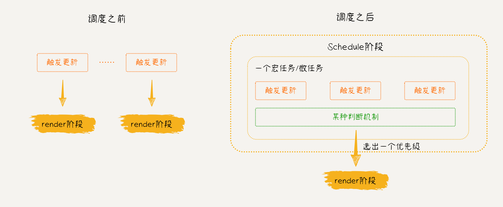

# 14. 实现同步调度流程

::: info 摘要

- 实现 Lane 模型
- 改造更新链表
- 实现调度阶段
- 改造更新流程

相关代码可在 [`git tag v1.14`](https://github.com/2xiao/my-react/tree/v1.14) 查看

:::

目前我们实现的更新流程中，从触发更新到 Render 阶段和 Commit 阶段，都是同步的，多次触发更新会重复多次执行更新流程。



为了提升性能，React 使用了批处理（Batched Updates）机制，批处理的目标是将多个更新操作合并成一个单一的更新，从而减少不必要的计算和渲染次数，提高应用的性能和响应速度。主要包括以下几个方面：

1. **合并更新：** 当调用 `setState()` 函数时，React 不会立即执行更新操作，而是将更新请求放入一个队列中等待执行，并将多个更新请求合并成一个更新。例如，如果一个组件在同一个事件循环中多次调用 `setState()`，React 只会执行一次更新，并以最新的状态进行渲染

2. **异步执行：** React 将更新操作延迟到浏览器的下一个事件循环中执行，以确保 UI 渲染时是最新的状态。

3. **优先级调度：** React 会根据更新的优先级和时间戳等因素进行调度，以保证在有限的时间内完成尽可能多的更新。这样可以确保及时响应用户操作，并保持良好的用户体验。

## 1. 实现 Lane 模型

Lane 是一个二进制的数字，表示一种优先级或者更新的类型，是用于调度和执行更新的一种机制，Lane 的数值越小，代表优先级越高；Lanes 可以看作是多个 Lane 的集合，用于表示系统中所有可能的更新任务的优先级。

通常情况下，可以将更新任务划分为不同的优先级，例如：高优先级更新、中等优先级更新和低优先级更新等。每个优先级都对应一个 Lane，当有更新任务产生时，会根据任务的优先级选择合适的 Lane，并将任务放入该 Lane 中，然后会根据 Lanes 中 Lane 的优先级顺序在合适的时机依次处理。

新建一个 `fiberLanes.ts` 文件，在里面实现 Lane 相关的定义和方法：

```ts
import { FiberRootNode } from './fiber';

// 代表 update 的优先级
export type Lane = number;
// 代表 lane 的集合
export type Lanes = number;

export const NoLane = 0b0000;
export const NoLanes = 0b0000;

export const SyncLane = 0b0001;

// 获取 Lane 的集合
export function mergeLanes(laneA: Lane, laneB: Lane): Lanes {
	return laneA | laneB;
}

// 获取更新的优先级
export function requestUpdateLanes() {
	return SyncLane;
}

// 获取 lanes 中优先级最高的 lane
export function getHighestPriorityLane(lanes: Lanes): Lane {
	// 默认规则：数值越小，优先级越高
	return lanes & -lanes;
}

// 从根节点的 pendingLanes 中移除某个 lane
export function markRootFinished(root: FiberRootNode, lane: Lane): void {
	root.pendingLanes &= ~lane;
}
```

## 2. 改造更新链表

每个 Fiber 节点的更新都保存在 `updateQueue` 属性中，当有新的更新时，会调用 `enqueueUpdate` 函数将 `update` 添加到 `updateQueue` 中。

但是目前我们实现的 `enqueueUpdate` 函数是直接将 `update` 赋值给 `updateQueue`，这样会覆盖掉之前的 `update`。

因此我们需要对 `enqueueUpdate` 函数进行修改，以确保新的更新能够正确地添加到更新队列中，可以采用一种链表的方式来组织更新队列，每个更新对象都保存着下一个更新对象的引用，从而形成一个链表结构，确保更新操作能够按顺序执行：


```ts
// packages/react-reconciler/src/updateQueue.ts
// 将 Update 添加到 UpdateQueue 中的方法
export const enqueueUpdate = <State>(
	updateQueue: UpdateQueue<State>,
	update: Update<State>
) => {
	const pending = updateQueue.shared.pending;
	if (pending === null) {
		update.next = update;
	} else {
		update.next = pending.next;
		pending.next = update;
	}
	// pending 指向 update 环状链表的最后一个节点
	updateQueue.shared.pending = update;
};
```

在这段代码中，我们将新的 `update` 添加到了更新链表的末尾，并将 `update.next` 指针指向链表中的第一个更新对象，最后将 `updateQueue.shared.pending` 指向 `update`，也就是链表的最后一个更新，这样可以方便我们添加和获取更新。

接着，我们为 `Update` 数据结构增加 `next` 和 `lane` 两个字段，同时修改创建 `Update` 实例的方法：

```ts
// packages/react-reconciler/src/updateQueue.ts
import { Lane } from './fiberLanes';

// 定义 Update 数据结构
export interface Update<State> {
	action: Action<State>;
	next: Update<any> | null;
	lane: Lane;
}

// 创建 Update 实例的方法
export const createUpdate = <State>(
	action: Action<State>,
	lane: Lane
): Update<State> => {
	return {
		action,
		next: null,
		lane
	};
};
```

显然，所有调用 `createUpdate` 函数创建 `Update` 的地方，我们都需要增加 `lane` 参数，目前有两个方法可以触发更新： `updateContainer` 和 `dispatchSetState`，分别对应了首屏渲染阶段和组件更新阶段。

::: code-tabs

@tab dispatchSetState

```ts{2,10-11,14}
// packages/react-reconciler/src/fiberHooks.ts
import { requestUpdateLanes } from './fiberLanes';

// 用于触发状态更新的逻辑
function dispatchSetState<State>(
	fiber: FiberNode,
	updateQueue: UpdateQueue<State>,
	action: Action<State>
) {
	const lane = requestUpdateLanes();
	const update = createUpdate(action, lane);
	enqueueUpdate(updateQueue, update);
	// 调度更新
	scheduleUpdateOnFiber(fiber, lane);
}
```

@tab updateContainer

```ts{2,9-10,15}
// packages/react-reconciler/src/fiberReconciler.ts
import { requestUpdateLanes } from './fiberLanes';

export function updateContainer(
	element: ReactElementType | null,
	root: FiberRootNode
) {
	const hostRootFiber = root.current;
	const lane = requestUpdateLanes();
	const update = createUpdate<ReactElementType | null>(element, lane);
	enqueueUpdate(
		hostRootFiber.updateQueue as UpdateQueue<ReactElementType | null>,
		update
	);
	scheduleUpdateOnFiber(hostRootFiber, lane);
	return element;
}
```

:::

这两个方法调用 `createUpdate` 函数创建 `update` 之后，会将更新加入 `updateQueue` 链表中，然后调用 `scheduleUpdateOnFiber` 函数开始调度更新。

接着，我们还需要对从 `updateQueue` 中消费 `update` 的流程进行改造。

- 给`processUpdateQueue` 函数增加第三个参数 `renderLane`，代表当前更新的优先级；
- 由于 `updateQueue` 是一个链表，因此需要遍历链表，依次消费符合当前更新优先级的 `update`；
- 执行完所有 `update` 之后，将计算出的最终值赋值给 `result.memoizedState`。

```ts
// 从 UpdateQueue 中消费 Update 的方法
export const processUpdateQueue = <State>(
	baseState: State,
	pendingUpdate: Update<State> | null,
	renderLane: Lane
): { memoizedState: State } => {
	const result: ReturnType<typeof processUpdateQueue<State>> = {
		memoizedState: baseState
	};
	if (pendingUpdate !== null) {
		// 第一个 update
		let first = pendingUpdate.next;
		let pending = first as Update<any>;
		do {
			const updateLane = pending.lane;
			if (updateLane == renderLane) {
				const action = pending.action;
				if (action instanceof Function) {
					// action 是回调函数
					baseState = action(baseState);
				} else {
					// action 是状态值
					baseState = action;
				}
			} else {
				if (__DEV__) {
					console.error('不应该进入 updateLane !== renderLane 逻辑');
				}
			}
			pending = pending.next as Update<any>;
		} while (pending !== first);
	}

	result.memoizedState = baseState;
	return result;
};
```

同样，每个调用 `processUpdateQueue` 函数消费 `Update` 的地方，都需要增加一个 `renderLane` 参数。有两个方法可以消费更新：`updateHostRoot` 和 `updateState`，分别对应了首屏渲染阶段和组件更新阶段。

这里不一一列举改造细节了，详见 [代码](https://github.com/2xiao/my-react/commit/73e3dbe1457c87eb533e71784ab8a37f801e5ead)。

## 3. 实现调度阶段

在之前的更新流程中，每次触发更新后，`scheduleUpdateOnFiber` 函数会从当前节点向上遍历到根节点，然后调用 Render 阶段的入口 `renderRoot` 函数， 构建 Fiber 树、处理新旧虚拟 DOM 树之间的差异、生成更新计划；在 `renderRoot` 函数执行完之后又会调用 Commit 阶段的入口 `commitRoot` 函数，将更新同步到实际的 DOM 中。

现在为了实现批处理机制，将多个更新操作合并成一个更新，我们需要在 Render 阶段和 Commit 阶段的基础上增加 Schedule 阶段（调度阶段）。


为了方便调度优先级，我们将优先级队列保存在根节点上。根节点作为整个应用的入口，将更新的状态信息存储在根节点上统一管理，可以更快地访问和检查哪些更新需要被处理，减少在整个组件树中查找的时间。

为 `FiberRootNode` 数据结构增加 `pendingLanes` 和 `finishedLane` 两个字段，其中 `pendingLanes` 用于标识当前有哪些更新需要被处理，`finishedLane` 用于表示已经完成处理的更新。

```ts{2,8-9,12-13}
// packages/react-reconciler/src/fiber.ts
import { Lane, Lanes, NoLane, NoLanes } from './fiberLanes';

export class FiberRootNode {
	container: Container;
	current: FiberNode;
	finishedWork: FiberNode | null;
	pendingLanes: Lanes;
	finishedLane: Lane;
	constructor(container: Container, hostRootFiber: FiberNode) {
		// ...
		this.pendingLanes = NoLanes;
		this.finishedLane = NoLane;
	}
}
```

接着，我们回到 `scheduleUpdateOnFiber` 函数，为函数增加 `lane` 参数。

因为所有更新的 `lane` 都被保存在根节点的 `pendingLanes` 中，所以每当触发更新时，我们都需要将此次更新的 `lane` 记录到 `FiberRootNode.pendingLanes` 中。这个工作由 `markRootUpdated` 函数完成：

```ts{4,8-11}
// packages/react-reconciler/src/workLoop.ts
export function scheduleUpdateOnFiber(fiber: FiberNode, lane: Lane) {
	const root = markUpdateFromFiberToRoot(fiber);
	markRootUpdated(root, lane);
	renderRoot(root);
}

// 将更新的优先级(lane)记录到根节点上
function markRootUpdated(root: FiberRootNode, lane: Lane) {
	root.pendingLanes = mergeLanes(root.pendingLanes, lane);
}
```

接着就要调用 `renderRoot` 函数，进入 Render 阶段了。

但是我们不希望每次触发更新都执行一次更新流程，因此，要在这里插入一个调度流程，根据某种判断机制选出一个优先级，然后在一个宏任务或微任务中合并更新，只执行一次 `renderRoot`。


接下来，我们就来实现调度流程的入口 `ensureRootIsScheduled` 函数，实现原理如下：

1. **获取最高优先级的更新**：首先，从根节点的 `pendingLanes` 中选择一个最高优先级的更新，这里使用 `getHighestPriorityLane` 函数来选择优先级最高的更新；

2. **根据优先级调度任务**：根据选择的优先级，有两种不同的调度方式：

   - **同步优先级（SyncLane）**：如果选择的优先级是同步优先级，通常意味着有一些紧急且立即需要处理的更新，那么就会使用微任务调度。在这种情况下，`renderRoot` 函数会被添加到微任务队列中调度执行，以确保它在当前任务执行完毕后立即执行。
   - **其他优先级**：如果选择的优先级不是同步优先级，说明这个更新可以稍后处理，那么就需要使用宏任务调度。在这种情况下，可以使用类似 `setTimeout` 的机制来安排任务，在主事件循环的下一个循环周期内执行更新。

3. **安排微任务**：调用 `scheduleMicroTask` 函数安排一个微任务，在微任务中执行更新。

```ts{2-4,9,12-23}
// packages/react-reconciler/src/workLoop.ts
import { getHighestPriorityLane } from './fiberLanes'
import { scheduleSyncCallback, flushSyncCallback } from './syncTaskQueue';
import { scheduleMicroTask } from 'hostConfig';

export function scheduleUpdateOnFiber(fiber: FiberNode, lane: Lane) {
	const root = markUpdateFromFiberToRoot(fiber);
	markRootUpdated(root, lane);
	ensureRootIsScheduled(root);
}

// Schedule 阶段入口
function ensureRootIsScheduled(root: FiberRootNode) {
	const updateLane = getHighestPriorityLane(root.pendingLanes);
	if (updateLane == NoLane) return;
	if (updateLane === SyncLane) {
		// 同步优先级，用微任务调度
		scheduleSyncCallback(renderRoot.bind(null, root, updateLane));
		scheduleMicroTask(flushSyncCallback);
	} else {
		// 其他优先级，用宏任务调度
	}
}
```

现在，我们来实现 `scheduleSyncCallback` 函数和 `flushSyncCallback` 函数。

新建一个 `syncTaskQueue.ts` 文件，这个文件中保存了与同步任务相关的状态和函数。

- `scheduleSyncCallback`

  - `scheduleSyncCallback` 函数负责将传入的回调函数 `callback` 添加到 `syncQueue` 中，`syncQueue` 中保存了当前的同步任务队列。具体步骤如下：
  - 如果 `syncQueue` 为 `null`，表示当前没有待执行的回调函数，需要创建一个新的队列来存储回调函数；
  - 如果 `syncQueue` 已经存在，则直接将回调函数添加到队列的末尾。

- `flushSyncCallback`

  - `flushSyncCallback` 函数会遍历 `syncQueue` 中的同步任务队列，并依次执行队列中的回调函数；
  - 我们使用 `isFlushingSyncQueue` 标志位来表示当前是否正在执行队列中的回调函数；
  - 这样的设计可以确保在执行同步回调函数期间不会再次触发 `flushSyncCallback` 函数，并且在同步执行期间防止其他异步任务的插入，以保证同步执行的正确性和稳定性；
  - 微任务执行完之后，重置 `syncQueue` 和 `isFlushingSyncQueue`。

```ts
// packages/react-reconciler/src/syncTaskQueue.ts
// 同步的任务队列
let syncQueue: ((...args: any) => void)[] | null = null;
let isFlushingSyncQueue: boolean = false;

// 调度同步的回调函数
export function scheduleSyncCallback(callback: (...args: any) => void) {
	if (syncQueue === null) {
		syncQueue = [callback];
	}
	syncQueue.push(callback);
}

// 遍历执行同步的回调函数
export function flushSyncCallback() {
	if (!isFlushingSyncQueue && syncQueue) {
		isFlushingSyncQueue = true;
		try {
			syncQueue.forEach((callback) => callback());
		} catch (e) {
			if (__DEV__) {
				console.error('flushSyncCallback 报错', e);
			}
		} finally {
			isFlushingSyncQueue = false;
			syncQueue = null;
		}
	}
}
```

`scheduleMicroTask` 函数的作用是安排一个微任务，在当前任务执行完成后立即执行。

为了确保在各种不同的环境下都能够正确地安排微任务，并确保任务的及时执行，需要对不同的环境做出兼容，具体实现原理是：

- 首先，检查全局环境中是否存在 `queueMicrotask` 函数，如果存在，则使用 `queueMicrotask` 函数来安排微任务；
- 否则，检查 `Promise` 构造函数是否存在并可用。如果可用，则创建一个 `Promise` 对象并立即将其解析（resolve），然后执行传入的回调函数。通过 `Promise.resolve(null).then(callback)` 的方式，可以将传入的回调函数作为微任务安排在微任务队列中；
- 如果以上二者都没有，那么将回退到使用 `setTimeout` 函数来安排任务。在这种情况下，会将传入的回调函数安排在下一个宏任务队列中，而不是微任务队列中。

```ts
// packages/react-dom/src/hostConfig.ts
export const scheduleMicroTask =
	typeof queueMicrotask === 'function'
		? queueMicrotask
		: typeof Promise === 'function'
		? (callback: (...args: any) => void) => Promise.resolve(null).then(callback)
		: setTimeout;
```

现在我们已经实现了 Schedule 阶段，将多个更新合并到一个微任务中执行，现在我们来回顾一下 Schedule 阶段的流程，以下面这个函数组件为例：

```jsx
function App() {
	const [count, setCount] = useState(1210);
	return (
		<div
			onClick={() => {
				setCount((count) => count + 1);
				setCount((count) => count + 1);
				setCount((count) => count + 1);
			}}
		>
			{count}
		</div>
	);
}
```

- 每次点击 `div` 都会触发三次 `dispatchSetState` 更新，然后进入 `scheduleUpdateOnFiber` 函数中调度更新;
- 首先，`markRootUpdated` 函数会将每次更新的 `lane` 存入 `root.pendingLanes` 中，经过三次 `mergeLanes` 后的 `root.pendingLanes` 值为 `SyncLane`;
- 接着，调用 `ensureRootIsScheduled` 函数，开始调度阶段，因为此时的 `updateLane === SyncLane`，为同步任务，因此会安排一个微任务来执行更新；
- `scheduleSyncCallback` 函数会被执行三次，所以此时的 `syncQueue` 值为三个 `renderRoot` 回调函数数组（`[renderRoot, renderRoot, renderRoot]`）;
- `flushSyncCallback` 函数同样会被调用三次，但是因为有 `isFlushingSyncQueue` 标志位，所以函数只会执行一次；
- 最终，在 `scheduleMicroTask` 创建的微任务中，`syncQueue` 中的三个 `renderRoot` 回调函数会被遍历执行。

也就是说，在微任务中，`renderRoot` 函数还是会被执行三次，这显然不符合预期，因此，我们还需要对 `renderRoot` 函数及之后的更新流程做一些改造。

## 4. 改造更新流程

要解决上述问题，我们只需要在 `renderRoot` 函数第一次执行之后，也就是在进入 `commitRoot` 函数时，立即从根节点的 `pendingLanes` 中移除该更新的 `lane`，此时 `root.pendingLanes` 就为 `NoLane` 了。

然后在进入 `renderRoot` 函数时加一个判断：如果根节点的 `pendingLanes` 中最高优先级的 `lane` 不是 `SyncLane`，代表此时的 `pendingLanes` 中只剩一些比 `SyncLane` 低的 `lane` 或 `NoLane` 了， 直接 `return` 即可。

这样，我们就解决了 `renderRoot` 函数多次执行的问题，具体的代码实现如下：

```ts
function renderRoot(root: FiberRootNode, lane: Lane) {
	const nextLane = getHighestPriorityLane(root.pendingLanes);
	if (nextLane !== SyncLane) {
		// 其他比 SyncLane 低的优先级或 NoLane，重新调度
		ensureRootIsScheduled(root);
		return;
	}

	// ...
}

function commitRoot(root: FiberRootNode) {
    // ...
    const lane = root.finishedLane;
	markRootFinished(root, lane);
	// 重置
	root.finishedLane = NoLane;

    // ...
```

---

至此，我们就实现了同步调度流程，可以将多个更新合并，按照优先级在一个微任务中执行。

同步调度流程能够即时响应状态变化和更新，一些高优先级的任务会在微任务中立即执行，从而优化了应用的性能和响应速度。通过将多个状态更新或 DOM 操作合并为一次更新执行，减少了浏览器执行的重排（reflow）和重绘（repaint）次数，这可以大大提高性能，减少页面的闪烁和卡顿。

相关代码可在 `git tag v1.14` 查看，地址：[https://github.com/2xiao/my-react/tree/v1.14](https://github.com/2xiao/my-react/tree/v1.14)
