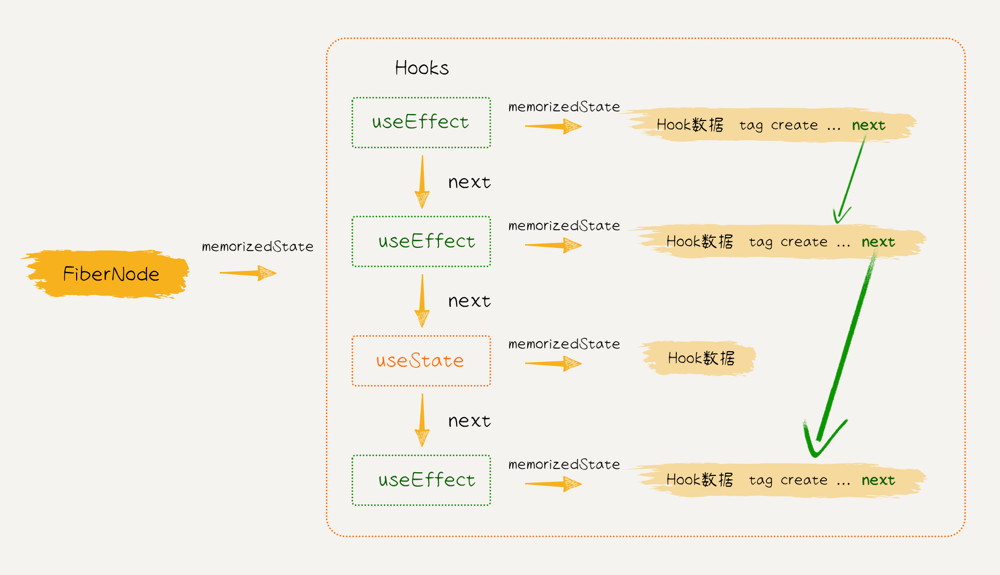
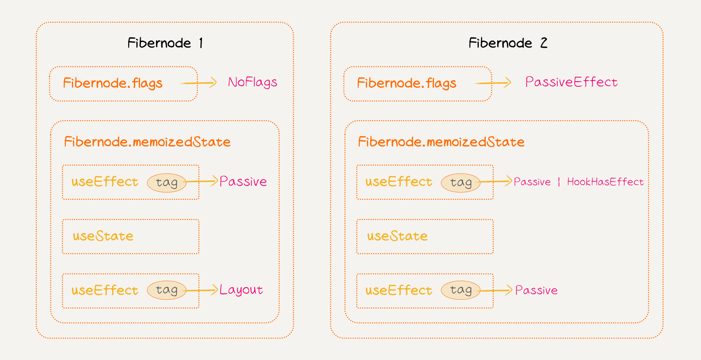
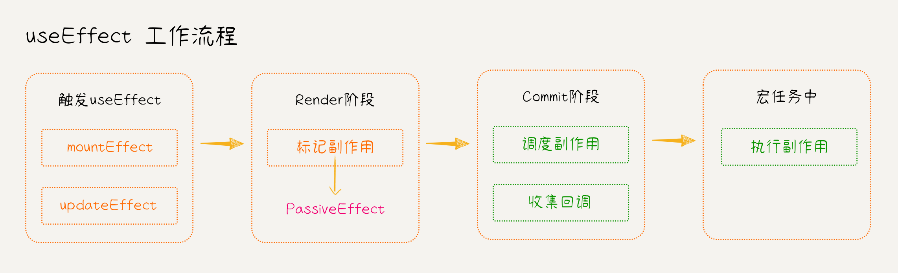

# 15. 实现 useEffect

::: info 摘要

- 定义数据结构
- 实现 useEffect
- 实现工作流程

相关代码可在 [`git tag v1.15`](https://github.com/2xiao/my-react/tree/v1.15) 查看

:::

`useEffect` 是 React Hooks 中的一个关键函数，用于在函数式组件中执行副作用操作。副作用指的是组件之外的操作，例如数据获取、订阅事件、手动操作 DOM 等。`useEffect` 可以在组件的渲染过程中执行这些操作，并且可以控制何时执行以及是否需要清理。

`useEffect` 函数的基本语法如下：

```javascript
useEffect(() => {
	// 副作用操作 creact 函数
	return () => {
		// destroy 函数
	};
}, [dependencies]);
```

- 第一个参数是一个回调函数，它包含需要执行的副作用代码（create 函数）；
- 回调函数可以返回一个清理函数（destroy 函数），用于清理副作用（比如取消订阅、清除定时器等）；
- 第二个参数是一个数组，用于指定依赖项。当这些依赖项发生变化时，将重新运行回调函数；如果省略第二个参数，则默认每次渲染都会运行回调函数。

## 1. 定义数据结构

我们定义一个 `Effect` 接口，用该接口描述 `useEffect` 函数的数据结构，其中：

- `tag`：表示副作用类型的标记，React 中好几种不同的副作用，如 `Passive`、`Layout` 等；
- `create`：表示在组件渲染完成后执行的副作用函数，是一个无参数无返回值的函数；
- `destroy`：表示在组件被销毁前执行的清理函数，也是一个无参数无返回值的函数；
- `deps`：包含此副作用函数依赖的值，这些值的变化将触发副作用函数的重新执行，是一个数组；
- `next`：是一个指向下一个副作用的指针，这样可以将多个副作用链接在一起，方便查找遍历。

```ts
// packages/react-reconciler/src/fiberHooks.ts
export interface Effect {
	tag: EffectTags;
	create: EffectCallback | void;
	destroy: EffectCallback | void;
	deps: EffectDeps;
	next: Effect | null;
}

type EffectCallback = () => void;
type EffectDeps = any[] | null;
```

在 [第 8 节](./8.md) 中我们学到，在 FiberNode 节点的 `memoizedState` 字段中保存着待执行的 Hooks 链表；链表中的每个 Hook 通过 `next` 指针连接在一起，而每个 Hook 也有一个 `memoizedState` 字段，指向了对应的 Hook 数据。

而我们刚才定义的 `Effect` 数据就是一种保存在 `hook.memoizedState` 中的 Hook 数据。

我们注意到 `Effect` 数据结构中也有一个 `next` 指针，它指向下一个副作用的 `hook.memoizedState`，这样就将所有的副作用连接起来，形成了一个副作用链表。

后续在执行副作用回调函数时，就不用遍历 Hooks 链表，在里面找 effect 类型的 Hook，而只需直接遍历副作用链表即可。



接着，在新建的 `hookEffectTags.ts` 文件中定义副作用类型(`Effect.tag`)，其中：

- `Passive`：代表 `useEffect` 的副作用类型；
- `Layout`：代表另一种 Hook `useLayoutEffect` 的副作用类型；
- `HookHasEffect`：表示本次更新中需要触发 effect 的回调函数；

```ts
// packages/react-reconciler/src/hookEffectTags.ts
// 保存在 Effect.tag 中的 tags
export type EffectTags = number;

// Fiber 节点本次更新存在副作用
export const HookHasEffect = 0b0001;

export const Passive = 0b0010; // useEffect
export const Layout = 0b0100; // useLayoutEffect
```

然后在 `fiberFlags.ts` 文件中新增更新标记 flags，其中：

- `PassiveEffect`：代表 Fiber 节点本次更新存在副作用；
- `PassiveMask`：代表需要执行 `useEffect` 回调函数的时机，分别是：依赖变化时，或函数组件卸载时；

```ts
// packages/react-reconciler/src/fiberFlags.ts
// Fiber 节点本次更新存在副作用
export const PassiveEffect = 0b0010000;
// 执行 useEffect 回调函数的时机：依赖变化时，或函数组件卸载时
export const PassiveMask = PassiveEffect | ChildDeletion;
```

`EffectTags` 和 `Flags` 两种二进制位掩码的关系如下图所示：



- 对于 FiberNode 的 Hooks 链表中的 effect 来说：
  - 用`Passive` 和 `useEffect` 代表不同类型的 effect；
  - 用 `HookHasEffect` 代表本次更新中需要触发 Effect 的回调函数；
- 对于一个 FiberNode 来说：
  - 若 Hooks 链表中的 effect 有 `Passive | HookHasEffect` 两个标识，`FiberNode.flags` 才会新增 `PassiveEffect`字段，代表本次更新中存在副作用；
  - 否则，若 Hooks 链表中的 effect 只有 `Passive` 而没有 `HookHasEffect` 标识，则本次更新不执行回调函数，没有副作用；

## 2. 实现 useEffect

和实现 `useState` 一样，我们也需要根据不同的上下文环境，实现不同的 `useEffect`：

- 在组件挂载 mount 阶段的 Hooks 集合 `HooksDispatcherOnMount` 中实现 `mountEffect`;
- 在组件更新 update 阶段的 Hooks 集合 `HooksDispatcherOnUpdate` 中实现 `updateEffect`;

```ts
// packages/react-reconciler/src/fiberHooks.ts
const HooksDispatcherOnMount: Dispatcher = {
	useState: mountState,
	useEffect: mountEffect
};

const HooksDispatcherOnUpdate: Dispatcher = {
	useState: updateState,
	useEffect: updateEffect
};
```

这里也需要在 `Dispatcher` 中增加 `useEffect` 字段：

```ts
// packages/react/src/currentDispatcher.ts
export interface Dispatcher {
	useState: <S>(initialState: (() => S) | S) => [S, Dispatch<S>];
	useEffect: (callback: () => void | void, deps: any[] | void) => void;
}
```

并在 `react` 包中导出 `useEffect` 方法：

```ts
// packages/react/index.ts
export const useEffect: Dispatcher['useEffect'] = (creact, deps) => {
	const dispatcher = resolveDispatcher();
	return dispatcher.useEffect(creact, deps);
};
```

### 1. 实现 mountEffect

`mountEffect` 函数接受两个参数：

- `create`：表示在组件挂载阶段或更新阶段后执行的副作用函数，它是一个无参数无返回值的函数。
- `deps`：表示副作用函数所依赖的值的集合，当这些值发生变化时，副作用函数将重新执行，是一个数组。

`useEffect` 的回调函数会在组件挂载时或者依赖变化时执行，因此在 `mountEffect` 函数中，我们需要给当前 FiberNode 增加一个 `PassiveEffect` 更新标记。

接着我们要创建一个新的 Effect 对象，并将其添加到当前正在处理的 Hook 上，Effect 对象的 tag 为 `Passive | HookHasEffect`，代表本次更新中需要触发 `useEffect` 的回调函数。

```ts
// packages/react-reconciler/src/fiberHooks.ts
function mountEffect(create: EffectCallback | void, deps: EffectDeps | void) {
	// 当前正在工作的 useEffect
	const hook = mountWorkInProgressHook();
	const nextDeps = deps == undefined ? null : deps;

	(currentlyRenderingFiber as FiberNode).flags |= PassiveEffect;
	hook.memoizedState = pushEffect(
		Passive | HookHasEffect,
		create,
		undefined,
		nextDeps
	);
}
```

`pushEffect` 函数的作用是将 `useEffect` 副作用按照执行顺序构建成一个副作用链表，并将链表保存在节点的 `updateQueue` 属性上。

- 首先，创建一个新的 `Effect` 对象，其属性包括了副作用的类型（`tag`）、副作用函数（`create` 和 `destroy`）、依赖项（`deps`）以及下一个副作用节点的引用（`next`）；
- 然后，获取当前正在渲染的 Fiber 节点，并从中获取更新队列（`updateQueue`）；
- 为 `updateQueue` 增加了一个 `lastEffect` 字段，用于储存构建的副作用链表；
- 如果当前 Fiber 节点没有更新队列，说明这是首次渲染该组件，因此需要创建一个新的更新队列，并将新的副作用设置为链表的唯一节点；
- 如果当前 Fiber 节点已经有更新队列，则将新的副作用节点添加到链表的尾部，并将其 `next` 指向链表的头部，形成一条环状链表，方便更新和查找。
- 最后返回创建的副作用节点。

```ts
// packages/react-reconciler/src/fiberHooks.ts
function pushEffect(
	tag: EffectTags,
	create: EffectCallback | void,
	destroy: EffectCallback | void,
	deps: EffectDeps
): Effect {
	const effect: Effect = {
		tag,
		create,
		destroy,
		deps,
		next: null
	};
	const fiber = currentlyRenderingFiber as FiberNode;
	const updateQueue = fiber.updateQueue as FCUpdateQueue<any>;
	if (updateQueue === null) {
		const newUpdateQueue = creactFCUpdateQueue();
		effect.next = effect;
		newUpdateQueue.lastEffect = effect;
		fiber.updateQueue = newUpdateQueue;
	} else {
		const lastEffect = updateQueue.lastEffect;
		if (lastEffect == null) {
			effect.next = effect;
			updateQueue.lastEffect = effect;
		} else {
			const firstEffect = lastEffect.next;
			lastEffect.next = effect;
			effect.next = firstEffect;
			updateQueue.lastEffect = effect;
		}
	}
	return effect;
}

// 定义函数组件的 FCUpdateQueue 数据结构
export interface FCUpdateQueue<State> extends UpdateQueue<State> {
	lastEffect: Effect | null;
}
```

### 2. 实现 updateEffect

`updateEffect` 和 `mountEffect` 的实现原理类似，不同的地方是：

- 在组件更新阶段，需要增加判断，只有依赖变化时，才标记回调函数执行；
- 在组件更新阶段，在新的副作用函数执行之前，需要清理之前的副作用；

具体来说，当组件重新渲染时，首先会检查 `useEffect` 的依赖项是否发生了变化：

- 如果依赖项没有变化，将不会执行新的副作用函数，而是继续使用之前创建的副作用。在这种情况下，为了确保旧的副作用函数能够被正确地清理，需要将之前的副作用的清理函数（即 `prevEffect.destroy`）传递给新创建的副作用函数；
- 如果依赖项发生了变化，会销毁之前的副作用函数并创建新的副作用函数。在这种情况下，需要确保旧的副作用函数能够被正确地清理，然后再创建新的副作用函数。因此，也需要将旧的副作用函数的清理函数（即 `prevEffect.destroy`）传递给新创建的副作用函数，以便在创建新的副作用函数之前执行清理操作。

```ts
// packages/react-reconciler/src/fiberHooks.ts
function updateEffect(create: EffectCallback | void, deps: EffectDeps | void) {
	// 当前正在工作的 useEffect
	const hook = updateWorkInProgressHook();
	const nextDeps = deps == undefined ? null : (deps as EffectDeps);
	let destroy: EffectCallback | void;

	if (currentHook !== null) {
		const prevEffect = currentHook.memoizedState as Effect;
		destroy = prevEffect.destroy;
		if (nextDeps !== null) {
			// 浅比较依赖
			const prevDeps = prevEffect.deps;
			// 浅比较相等，依赖没有变化
			if (areHookInputsEqual(nextDeps, prevDeps)) {
				hook.memoizedState = pushEffect(Passive, create, destroy, nextDeps);
				return;
			}
			// 浅比较不相等，依赖变化了
			(currentlyRenderingFiber as FiberNode).flags |= PassiveEffect;
			hook.memoizedState = pushEffect(
				Passive | HookHasEffect,
				create,
				destroy,
				nextDeps
			);
		}
	}
}

function areHookInputsEqual(
	nextDeps: EffectDeps,
	prevDeps: EffectDeps
): boolean {
	if (nextDeps === null || prevDeps === null) return false;
	for (let i = 0; i < nextDeps.length && i < prevDeps.length; i++) {
		if (Object.is(nextDeps[i], prevDeps[i])) {
			continue;
		}
		return false;
	}
	return true;
}
```

## 3. 实现工作流程

接着我们实现 `useEffect` 的工作流程，将 `useEffect` 加入已有的更新流程中。



### 1. 调度副作用

调度副作用需要使用调度器 [Scheduler](https://github.com/facebook/react/tree/main/packages/scheduler)，调度器也是 React 项目下的模块，我们先不实现它，直接安装官方实现版本来使用：

```bash
pnpm i -w scheduler
pnpm i -D -w @types/scheduler
```

我们在 commitRoot 函数中，使用 Scheduler 来调度副作用，使得回调函数在 `setTimeout` 中以 NormalPriority 优先级被调度执行。

- 使用 `rootDoesHasPassiveEffects` 标志位来表示是否正在调度副作用，避免重复调度；
- 通过检查 `finishedWork` 中的标志位（`flags` 和 `subtreeFlags`），判断 Fiber 树中是否存在副作用；
- 如果存在副作用，那么将 `rootDoesHasPassiveEffects` 设置为 `true`，表示根节点存在副作用；
- 接着调用 `scheduleCallback` 函数来调度执行副作用。副作用的执行被安排在下一个事件循环中，以确保在当前任务执行完成后执行副作用。副作用的调度优先级是 `NormalPriority`，表示一般的正常优先级；
- 在回调函数中，执行 `flushPassiveEffects` 函数来执行副作用。这个函数会执行根节点中挂起的副作用；
- 最后重置 `rootDoesHasPassiveEffects` 为 `false`，并再次确保根节点被调度；

```ts
// packages/react-reconciler/src/workLoop.ts
import {
	unstable_scheduleCallback as scheduleCallback,
	unstable_NormalPriority as NormalPriority
} from 'scheduler';

let rootDoesHasPassiveEffects: Boolean = false;

function commitRoot(root: FiberRootNode) {
	// ...
	const { flags, subtreeFlags } = finishedWork;

	// 判断 Fiber 树是否存在副作用
	if (
		(flags & PassiveMask) !== NoFlags ||
		(subtreeFlags & PassiveMask) !== NoFlags
	) {
		if (!rootDoesHasPassiveEffects) {
			rootDoesHasPassiveEffects = true;
			// 调度副作用
			// 回调函数在 setTimeout 中以 NormalPriority 优先级被调度执行
			scheduleCallback(NormalPriority, () => {
				// 执行副作用
				flushPassiveEffects(root.pendingPassiveEffects);
				return;
			});
		}
	}

	rootDoesHasPassiveEffects = false;
	ensureRootIsScheduled(root);
}
```

### 2. 收集回调

我们需要收集两类回调：

- unmount 时执行的 destroy 函数；
- update 时执行的 create 函数；

将这个收集到的回调保存在 root 节点上，为 `FiberRootNode` 增加一个 `pendingPassiveEffects` 字段用来存放，该字段里有一个 `unmount` 数组，保存着收集到的 destroy 函数；和一个 `update` 数组，保存着收集到的 create 函数：

```ts
// packages/react-reconciler/src/fiber.ts
import { Effect } from './fiberHooks';

export class FiberRootNode {
	// ...
	pendingPassiveEffects: PendingPassiveEffects;
	constructor(container: Container, hostRootFiber: FiberNode) {
		// ...
		this.pendingPassiveEffects = {
			unmount: [],
			update: []
		};
	}
}

export interface PendingPassiveEffects {
	unmount: Effect[];
	update: Effect[];
}
```

收集 `useEffect` 回调函数的时机在 Commit 阶段的两个关键时刻：

1. 在 `commitMutationEffectsOnFiber` 函数中，处理 Fiber 节点的更新 flags 时：

   - 当一个 Fiber 节点被更新时，可能会触发新的副作用或清理旧的副作用，因此需要在节点更新时收集；
   - 首先会检查该节点的更新标志位（flags），如果节点的标志位中包含了 `PassiveEffect`，则意味着该节点上存在需要处理的副作用；
   - 此时收集的回调函数将保存在 `pendingPassiveEffects.update` 中；

2. 在 `commitDeletion` 函数中，删除 Fiber 节点及其关联子树时：
   - 当一个 Fiber 节点被删除时，需要清理该节点及其子树的相关资源，包括执行副作用的清理操作，特别是在函数组件中的 `useEffect` 副作用；
   - 为了保证组件被正确地卸载并清理相关资源，需要在节点被删除时收集；
   - 此时收集的回调函数将保存在 `pendingPassiveEffects.unmount` 中；

```ts
// packages/react-reconciler/src/commitWork.ts
const commitMutationEffectsOnFiber = (
	finishedWork: FiberNode,
	root: FiberRootNode
) => {
	const flags = finishedWork.flags;
	// ...
	if ((flags & PassiveEffect) !== NoFlags) {
		// 收集回调
		commitPassiveEffect(finishedWork, root, 'update');
		finishedWork.flags &= ~PassiveEffect;
	}
};

// 删除节点及其子树
const commitDeletion = (childToDelete: FiberNode, root: FiberRootNode) => {
	// ...
	// 递归遍历子树
	commitNestedUnmounts(childToDelete, (unmountFiber) => {
		switch (unmountFiber.tag) {
			case FunctionComponent:
				commitPassiveEffect(unmountFiber, root, 'unmount');
				return;
			// ...
		}
	});
	// ...
};
```

收集回调的工作由 `commitPassiveEffect` 函数负责，它将当前 Fiber 节点对应类型的副作用回调函数收集到根节点的 `pendingPassiveEffects`，以便稍后在适当的时机执行这些副作用。

下面是 `commitPassiveEffect` 函数的实现原理：

- 首先，函数会判断当前 Fiber 节点的类型是否是函数组件（`FunctionComponent`）。如果不是函数组件，则直接返回，因为只有函数组件才会有 `useEffect` 副作用；
- 如果是函数组件，函数会进一步检查当前节点的标志位，只有当节点的标志位中包含 `PassiveEffect` 标志位时，才会处理副作用；
- 获取当前 Fiber 节点的副作用链表 `updateQueue.lastEffect`，并将其推入根节点 `pendingPassiveEffects` 相应类型的数组中。

```ts
// packages/react-reconciler/src/commitWork.ts
const commitPassiveEffect = (
	fiber: FiberNode,
	root: FiberRootNode,
	type: keyof PendingPassiveEffects
) => {
	if (
		fiber.tag !== FunctionComponent ||
		(type == 'update' && (fiber.flags & PassiveEffect) == NoFlags)
	) {
		return;
	}
	const updateQueue = fiber.updateQueue as FCUpdateQueue<any>;
	if (updateQueue !== null) {
		if (updateQueue.lastEffect == null && __DEV__) {
			console.error('commitPassiveEffect: updateQueue.lastEffect is null');
		} else {
			root.pendingPassiveEffects[type].push(updateQueue.lastEffect as Effect);
		}
	}
};
```

### 3. 执行副作用

最后，我们来实现被 `scheduleCallback` 调度执行的 flushPassiveEffects 函数，它负责按照特定顺序，依次执行之前收集到的所有副作用回调函数，依次为：

`flushPassiveEffects` 函数的主要作用是执行收集到的所有副作用回调函数，并按照特定顺序依次执行这些回调函数。具体来说，它会执行以下几个步骤：

1. **触发所有 unmount 中的 destroy 回调：** 首先，遍历 `pendingPassiveEffects.unmount` 数组中的每个 destroy 回调函数，逐个执行并清理与之相关的资源，这些回调函数通常是在组件卸载时触发的清理函数。

2. **触发所有上次更新的 destroy 回调：** 然后，遍历 `pendingPassiveEffects.update` 数组中的每个 destroy 回调函数，执行上次更新时产生的清理函数。

3. **触发所有这次更新的 create 回调：** 接着，再次遍历 `pendingPassiveEffects.update` 数组中的每个 create 回调函数，执行这次更新时产生的副作用函数。

4. **执行 useEffect 过程中可能触发新的更新：** 最后，由于在执行副作用函数的过程中可能触发新的更新，因此需要再次调用 `flushSyncCallback` 函数处理这些更新的更新流程，确保所有更新得到正确的执行和调度。

```ts
// packages/react-reconciler/src/workLoop.ts
function flushPassiveEffects(pendingPassiveEffects: PendingPassiveEffects) {
	// 先触发所有 unmount destroy
	pendingPassiveEffects.unmount.forEach((effect) => {
		commitHookEffectListUnmount(Passive, effect);
	});
	pendingPassiveEffects.unmount = [];

	// 再触发所有上次更新的 destroy
	pendingPassiveEffects.update.forEach((effect) => {
		commitHookEffectListDestory(Passive | HookHasEffect, effect);
	});

	// 再触发所有这次更新的 create
	pendingPassiveEffects.update.forEach((effect) => {
		commitHookEffectListCreate(Passive | HookHasEffect, effect);
	});
	pendingPassiveEffects.update = [];

	// 执行 useEffect 过程中可能触发新的更新
	// 再次调用 flushSyncCallback 处理这些更新的更新流程
	flushSyncCallback();
}
```

其中，`commitHookEffectListUnmount`、`commitHookEffectListDestory`、`commitHookEffectListCreate` 的作用都是依次遍历环状副作用链表，并执行其回调函数。

```ts
// packages/react-reconciler/src/commitWork.ts
const commitHookEffectList = (
	tags: EffectTags,
	lastEffect: Effect,
	callback: (effect: Effect) => void
) => {
	let effect = lastEffect.next as Effect;

	do {
		if ((effect.tag & tags) === tags) {
			callback(effect);
		}
		effect = effect.next as Effect;
	} while (effect !== lastEffect.next);
};

// 组件卸载时，触发所有 unmount destroy
export function commitHookEffectListUnmount(
	tags: EffectTags,
	lastEffect: Effect
) {
	commitHookEffectList(tags, lastEffect, (effect) => {
		const destroy = effect.destroy;
		if (typeof destroy === 'function') {
			destroy();
		}
		effect.tag &= ~HookHasEffect;
	});
}

// 组件卸载时，触发所有上次更新的 destroy
export function commitHookEffectListDestory(
	tags: EffectTags,
	lastEffect: Effect
) {
	commitHookEffectList(tags, lastEffect, (effect) => {
		const destroy = effect.destroy;
		if (typeof destroy === 'function') {
			destroy();
		}
	});
}

// 组件卸载时，触发所有这次更新的 create
export function commitHookEffectListCreate(
	tags: EffectTags,
	lastEffect: Effect
) {
	commitHookEffectList(tags, lastEffect, (effect) => {
		const create = effect.create;
		if (typeof create === 'function') {
			effect.destroy = create();
		}
	});
}
```

至此，我们就实现了 `useEffect`，并将这个 Hook 加入了更新流程中。

相关代码可在 `git tag v1.15` 查看，地址：[https://github.com/2xiao/my-react/tree/v1.15](https://github.com/2xiao/my-react/tree/v1.15)
