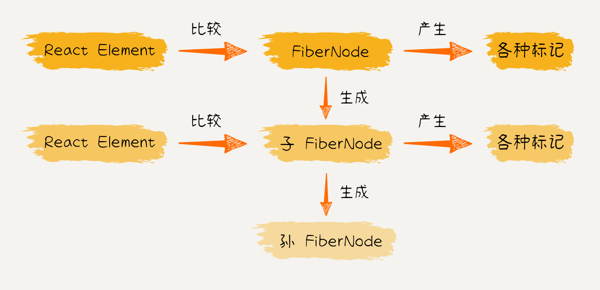

# 5. 实现组件树更新

::: info 摘要

- 开发环境打印日志
- 实现 beginWork
- 实现 completeWork

相关代码可在 [`git tag v1.5`](https://github.com/2xiao/my-react/tree/v1.5) 查看

:::

在上一节，我们探讨了 React 应用在首次渲染或后续更新时的整体更新流程。在 `Reconciler` 工作流程中，`beginWork` 和 `completeWork` 两个方法起到了关键作用。`beginWork` 负责构建表示更新的 Fiber 树，而 `completeWork` 则将这个 Fiber 树映射到实际的 DOM 结构上。接下来，我们将深入实现这两个方法。

## 1. 开发环境打印日志

首先，在开发环境下增加 `__DEV__` 标识，以便在开发环境中方便地打印日志：

```bash
pnpm i -D -w @rollup/plugin-replace
```

安装完成后，在 `scripts/rollup/utils.js` 中引入：

```javascript
// scripts/rollup/utils.js
// ...
import replace from '@rollup/plugin-replace';

// ...

export function getBaseRollupPlugins({
	alias = { __DEV__: true },
	typescript = {}
} = {}) {
	return [replace(alias), ts(), cjs(typescript)];
}
```

这样我们就可以在开发环境中打印日志了。

## 2. 实现 beginWork

`beginWork` 函数在向下遍历阶段执行，根据 Fiber 节点的类型（`HostRoot`、`HostComponent`、`HostText`）分发任务给不同的处理函数，处理具体节点类型的更新逻辑：

- **HostRoot**

  - 表示根节点，即应用的最顶层节点；
  - 调用 `updateHostRoot` 函数，处理根节点的更新，包括协调处理根节点的属性以及子节点的更新逻辑；
  - 调用 `reconcileChildren` 函数，处理根节点的子节点，可能会递归调用其他协调函数；
  - 返回 `workInProgress.child` 表示经过协调后的新的子节点链表；

- **HostComponent**

  - 表示原生 DOM 元素节点，例如 `<div>`、`<span>` 等；
  - 调用 `updateHostComponent` 函数，处理原生 DOM 元素节点的更新，负责协调处理属性和子节点的更新逻辑；
  - 调用 `reconcileChildren` 函数，处理原生 DOM 元素的子节点更新；
  - 返回 `workInProgress.child` 表示经过协调后的新的子节点链表；

- **HostText**

  - 表示文本节点，即 DOM 中的文本内容，例如 `<p>123</p>` 中的 `123`；
  - 调用 `updateHostText` 函数，协调处理文本节点的内容更新；
  - 返回 `null` 表示已经是叶子节点，没有子节点了；

其中 `reconcileChildren` 函数的作用是，通过对比子节点的 `current FiberNode` 与 子节点的 `ReactElement`，来生成子节点对应的 `workInProgress FiberNode`。（`current` 是与视图中真实 UI 对应的 Fiber 树，`workInProgress` 是触发更新后正在 Reconciler 中计算的 Fiber 树。）



```typescript
// packages/react-reconciler/src/beginWork.ts
import { ReactElementType } from 'shared/ReactTypes';
import { FiberNode } from './fiber';
import { UpdateQueue, processUpdateQueue } from './updateQueue';
import { HostComponent, HostRoot, HostText } from './workTags';
import { reconcileChildFibers, mountChildFibers } from './childFiber';

// 比较并返回子 FiberNode
export const beginWork = (workInProgress: FiberNode) => {
	switch (workInProgress.tag) {
		case HostRoot:
			return updateHostRoot(workInProgress);
		case HostComponent:
			return updateHostComponent(workInProgress);
		case HostText:
			return updateHostText();
		default:
			if (__DEV__) {
				console.warn('beginWork 未实现的类型', workInProgress.tag);
			}
			break;
	}
};

function updateHostRoot(workInProgress: FiberNode) {
	// 根据当前节点和工作中节点的状态进行比较，处理属性等更新逻辑
	const baseState = workInProgress.memoizedState;
	const updateQueue = workInProgress.updateQueue as UpdateQueue<Element>;
	const pending = updateQueue.shared.pending;
	// 清空更新链表
	updateQueue.shared.pending = null;
	// 计算待更新状态的最新值
	const { memoizedState } = processUpdateQueue(baseState, pending);
	workInProgress.memoizedState = memoizedState;

	// 处理子节点的更新逻辑
	const nextChildren = workInProgress.memoizedState;
	reconcileChildren(workInProgress, nextChildren);

	// 返回新的子节点
	return workInProgress.child;
}

function updateHostComponent(workInProgress: FiberNode) {
	const nextProps = workInProgress.pendingProps;
	const nextChildren = nextProps.children;
	reconcileChildren(workInProgress, nextChildren);
	return workInProgress.child;
}

function updateHostText() {
	// 没有子节点，直接返回 null
	return null;
}

// 对比子节点的 current FiberNode 与 子节点的 ReactElement
// 生成子节点对应的 workInProgress FiberNode
function reconcileChildren(
	workInProgress: FiberNode,
	children?: ReactElementType
) {
	// alternate 指向节点的备份节点，即 current
	const current = workInProgress.alternate;
	if (current !== null) {
		// 组件的更新阶段
		workInProgress.child = reconcileChildFibers(
			workInProgress,
			current?.child,
			children
		);
	} else {
		// 首屏渲染阶段
		workInProgress.child = mountChildFibers(workInProgress, null, children);
	}
}
```

`reconcileChildren` 函数中调用了 `reconcileChildFibers` 和 `mountChildFibers` 两个函数，它们分别负责处理更新阶段和首次渲染阶段的子节点协调。

- **reconcileChildFibers:**

  - `reconcileChildFibers` 函数作用于组件的更新阶段，即当组件已经存在于 DOM 中，需要进行更新时。
  - 主要任务是协调处理当前组件实例的子节点，对比之前的子节点（`current`）和新的子节点（`workInProgress`）之间的变化。
  - 根据子节点的类型和 key 进行对比，决定是复用、更新、插入还是删除子节点，最终形成新的子节点链表。

- **mountChildFibers:**
  - `mountChildFibers` 函数作用于组件的首次渲染阶段，即当组件第一次被渲染到 DOM 中时。
  - 主要任务是协调处理首次渲染时组件实例的子节点。
  - 但此时是首次渲染，没有之前的子节点，所以主要是创建新的子节点链表。

::: code-tabs

@tab childFiber.ts

```typescript
// packages/react-reconciler/src/childFiber.ts
import { ReactElementType } from 'shared/ReactTypes';
import { FiberNode, createFiberFromElement } from './fiber';
import { REACT_ELEMENT_TYPE } from 'shared/ReactSymbols';
import { HostText } from './workTags';
import { Placement } from './fiberFlags';

function ChildReconciler(shouldTrackSideEffects: boolean) {
	// 处理单个 Fragment 节点的情况
	// 对比 currentFiber 与 ReactElement
	// 生成 workInProgress FiberNode
	function reconcileSingleElement(
		returnFiber: FiberNode,
		currentFiber: FiberNode | null,
		element: ReactElementType
	) {
		const fiber = createFiberFromElement(element);
		fiber.return = returnFiber;
		return fiber;
	}

	// 处理文本节点的情况
	// 对比 currentFiber 与 ReactElement
	// 生成 workInProgress FiberNode
	function reconcileSingleTextNode(
		returnFiber: FiberNode,
		currentFiber: FiberNode | null,
		content: string | number
	) {
		const fiber = new FiberNode(HostText, { content }, null);
		fiber.return = returnFiber;
		return fiber;
	}

	// 为 Fiber 节点添加更新 flags
	function placeSingleChild(fiber: FiberNode) {
		// 首屏渲染且追踪副作用时，才添加更新 flags
		if (shouldTrackSideEffects && fiber.alternate == null) {
			fiber.flags |= Placement;
		}
		return fiber;
	}

	// 闭包，根绝 shouldTrackSideEffects 返回不同 reconcileChildFibers 的实现
	return function reconcileChildFibers(
		returnFiber: FiberNode,
		currentFiber: FiberNode | null,
		newChild?: ReactElementType
	) {
		// 判断当前 fiber 的类型
		// 单个 Fragment 节点
		if (typeof newChild == 'object' && newChild !== null) {
			switch (newChild.$$typeof) {
				case REACT_ELEMENT_TYPE:
					return placeSingleChild(
						reconcileSingleElement(returnFiber, currentFiber, newChild)
					);

				default:
					if (__DEV__) {
						console.warn('未实现的 reconcile 类型', newChild);
					}
					break;
			}
		}

		// 多个 Fragment 节点
		if (Array.isArray(newChild)) {
			// TODO: 暂时不处理
			if (__DEV__) {
				console.warn('未实现的 reconcile 类型', newChild);
			}
		}

		// 文本节点
		if (typeof newChild == 'string' || typeof newChild == 'number') {
			return placeSingleChild(
				reconcileSingleTextNode(returnFiber, currentFiber, newChild)
			);
		}

		if (__DEV__) {
			console.warn('未实现的 reconcile 类型', newChild);
		}
		return null;
	};
}

// 组件的更新阶段中，追踪副作用
export const reconcileChildFibers = ChildReconciler(true);

// 首屏渲染阶段中不追踪副作用，只对根节点执行一次 DOM 插入操作
export const mountChildFibers = ChildReconciler(false);
```

@tab fiber.ts

```typescript
// packages/react-reconciler/src/fiber.ts
// ...

// 根据 DOM 节点创建新的 Fiber 节点
export function createFiberFromElement(element: ReactElementType): FiberNode {
	const { type, key, props } = element;
	let fiberTag: WorkTag = FunctionComponent;
	if (typeof type == 'string') {
		// 如: <div/> 的 type: 'div'
		fiberTag = HostComponent;
	} else if (typeof type !== 'function' && __DEV__) {
		console.warn('未定义的 type 类型', element);
	}

	const fiber = new FiberNode(fiberTag, props, key);
	fiber.type = type;
	return fiber;
}
```

:::

## 3. 实现 completeWork

`completeWork` 函数在向上遍历阶段执行，根据 Fiber 节点的类型（`HostRoot`、`HostComponent`、`HostText` 等）构建 DOM 节点，收集更新 flags，并根据更新 flags 执行不同的 DOM 操作：

- **HostComponent:**

  - 表示原生 DOM 元素节点；
  - 构建 DOM 节点，并调用 `appendAllChildren` 函数将 DOM 插入到 DOM 树中；
  - 收集更新 flags，并根据更新 flags 执行不同的 DOM 操作，例如插入新节点、更新节点属性、删除节点等；

- **HostText:**

  - 表示文本节点；
  - 构建 DOM 节点，并将 DOM 插入到 DOM 树中；
  - 收集更新 flags，根据 flags 的值，更新文本节点的内容；

- **HostRoot:**

  - 表示根节点；
  - 会执行一些与根节点相关的最终操作，例如处理根节点的属性，确保整个应用更新完毕；

```typescript
// packages/react-reconciler/src/completeWork.ts
import {
	appendInitialChild,
	createInstance,
	createTextInstance
} from 'hostConfig';
import { FiberNode } from './fiber';
import { HostComponent, HostRoot, HostText } from './workTags';
import { NoFlags } from './fiberFlags';

// 生成更新计划，计算和收集更新 flags
export const completeWork = (workInProgress: FiberNode) => {
	const newProps = workInProgress.pendingProps;
	const current = workInProgress.alternate;
	switch (workInProgress.tag) {
		case HostRoot:
			bubbleProperties(workInProgress);
			return null;

		case HostComponent:
			if (current !== null && workInProgress.stateNode !== null) {
				// TODO: 组件的更新阶段
			} else {
				// 首屏渲染阶段
				// 构建 DOM
				const instance = createInstance(workInProgress.type, newProps);
				// 将 DOM 插入到 DOM 树中
				appendAllChildren(instance, workInProgress);
				workInProgress.stateNode = instance;
			}
			// 收集更新 flags
			bubbleProperties(workInProgress);
			return null;

		case HostText:
			if (current !== null && workInProgress.stateNode !== null) {
				// TODO: 组件的更新阶段
			} else {
				// 首屏渲染阶段
				// 构建 DOM
				const instance = createTextInstance(newProps.content);
				workInProgress.stateNode = instance;
			}
			// 收集更新 flags
			bubbleProperties(workInProgress);
			return null;

		default:
			if (__DEV__) {
				console.warn('completeWork 未实现的类型', workInProgress);
			}
			return null;
	}
};
```

其中，`appendAllChildren` 函数负责递归地将组件的子节点添加到指定的 `parent` 中，它通过深度优先遍历 `workInProgress` 的子节点链表，处理每个子节点的类型。先处理当前节点的所有子节点，再处理兄弟节点。

如果它是原生 DOM 元素节点或文本节点，则将其添加到父节点中；如果是其他类型的组件节点并且有子节点，则递归处理其子节点。

```typescript
// packages/react-reconciler/src/completeWork.ts
// ...

function appendAllChildren(parent: Container, workInProgress: FiberNode) {
	let node = workInProgress.child;
	while (node !== null) {
		if (node.tag == HostComponent || node.tag == HostText) {
			// 处理原生 DOM 元素节点或文本节点
			appendInitialChild(parent, node.stateNode);
		} else if (node.child !== null) {
			// 递归处理其他类型的组件节点的子节点
			node.child.return = node;
			node = node.child;
			continue;
		}
		if (node == workInProgress) {
			return;
		}

		while (node.sibling === null) {
			if (node.return === null || node.return === workInProgress) {
				return;
			}
			node = node.return;
		}
		// 处理下一个兄弟节点
		node.sibling.return = node.return;
		node = node.sibling;
	}
}
```

而 `bubbleProperties` 函数则负责在 `completeWork` 函数向上遍历的过程中，通过向上冒泡子节点的 flags，将所有更新 flags 收集到根节点。主要包含以下步骤：

- 从当前需要冒泡属性的 Fiber 节点开始，检查是否有需要冒泡的属性。
- 如果当前节点有需要冒泡的属性，将这些属性冒泡到父节点的 `subtreeFlags` 或其他适当的属性中。
- 递归调用 `bubbleProperties` 函数，处理父节点，将属性继续冒泡到更上层的祖先节点，直至达到根节点。

```typescript
// packages/react-reconciler/src/completeWork.ts
// ...

// 收集更新 flags，将子 FiberNode 的 flags 冒泡到父 FiberNode 上
function bubbleProperties(workInProgress: FiberNode) {
	let subtreeFlags = NoFlags;
	let child = workInProgress.child;
	while (child !== null) {
		subtreeFlags |= child.subtreeFlags;
		subtreeFlags |= child.flags;

		child.return = workInProgress;
		child = child.sibling;
	}

	workInProgress.subtreeFlags |= subtreeFlags;
}
```

### 位运算

flags 是 React 中很重要的一环，具体作用是通过二进制在每个 Fiber 节点保存其本身与子节点的 flags。在保存与处理 flags 时，使用了一些二进制运算符，我们来复习一下：

1. `|` 运算

`|` 运算的两个位都为 0 时，结果才为 0：

- `1 | 1 = 1`
- `1 | 0 = 1`
- `0 | 0 = 0`

React 利用了 `|` 运算符的特性来存储 flags，如：

```ts
const NoFlags = /*            */ 0b0000000;
const PerformedWork = /*      */ 0b0000001;
const Placement = /*          */ 0b0000010;
const Update = /*             */ 0b0000100;
const ChildDeletion = /*      */ 0b0001000;

const flags = Placement | Update; //此时 flags = 0b0000110
```

2. `&` 运算

`&` 运算的两个位都为 1 时，结果才为 1：

- `1 & 1 = 1`
- `1 & 0 = 0`
- `0 & 0 = 0`

React 中会用一个 flags `&` 某一个 flag，来判断 flags 中是否包含某一个 flag，如：

```ts
const flags = Placement | Update; //此时 flags = 0b0000110

Boolean(flags & Placement); // true, 说明 flags 中包含 Placement
Boolean(flags & ChildDeletion); // false, 说明 flags 中不包含 ChildDeletion
```

3. `~` 运算

`～` 运算符会把每一位取反，0 变 1，1 变 0：

- `~1 = 0`
- `~0 = 1`

在 React 中，`~` 运算符同样是常用操作，如：

```ts
let flags = Placement | Update; //此时 flags = 0b0000110

flags &= ~Placement; //此时 flags = 0b0000100
```

通过 `~` 运算符与 `&` 运算符的结合，从 flags 中删除了 `Placement` 这个 flag。

---

至此，我们就实现了 React 协调阶段中的 `beginWork` 和 `completeWork` 函数，生成了一棵表示更新的 Fiber 树，并收集了树中节点的更新 flags，下一节我们将根据这些 flags 执行对应的 DOM 操作。

相关代码可在 `git tag v1.5` 查看，地址：[https://github.com/2xiao/my-react/tree/v1.5](https://github.com/2xiao/my-react/tree/v1.5)
