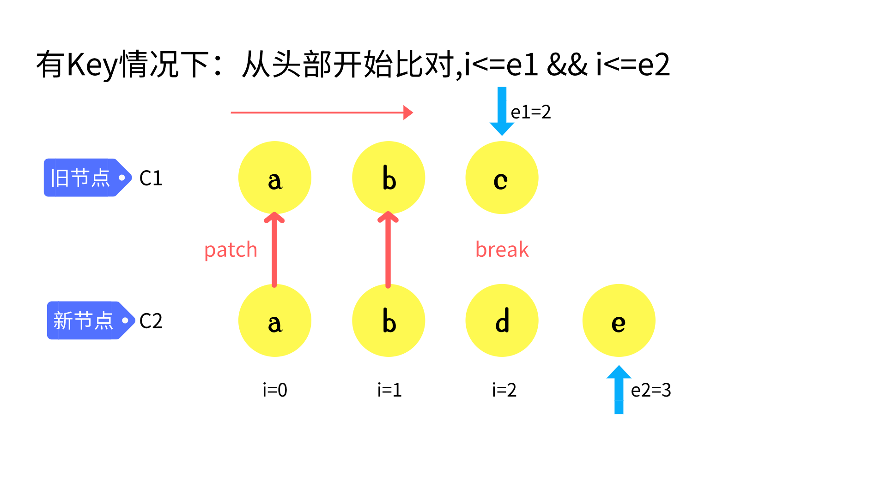
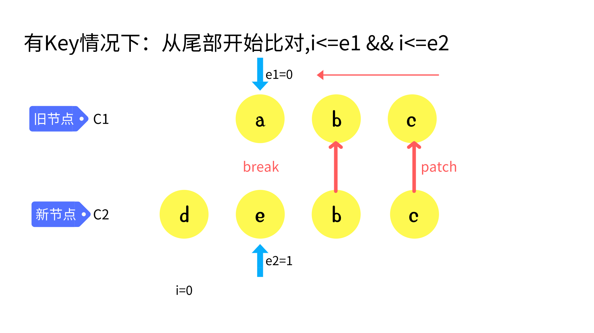
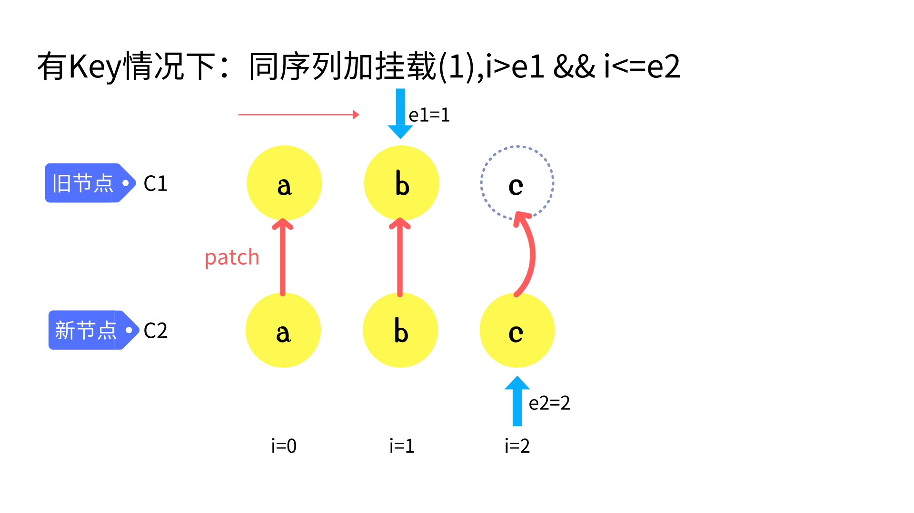
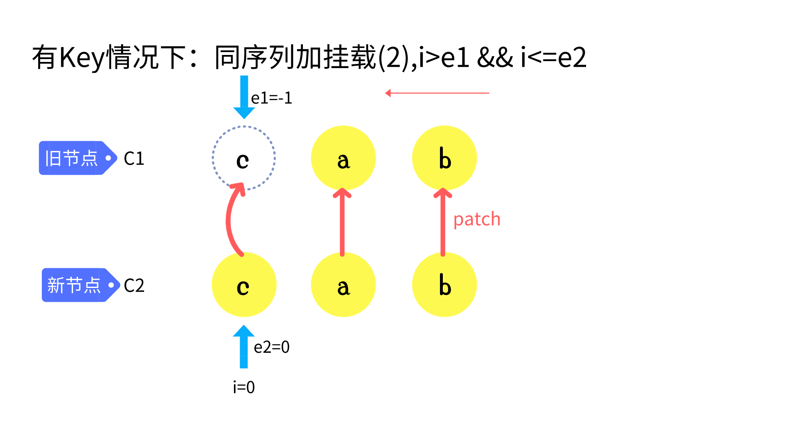
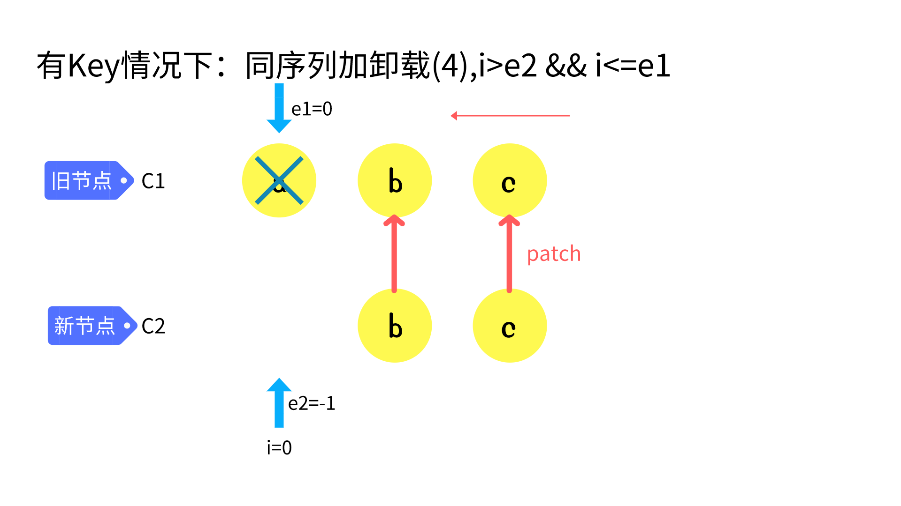
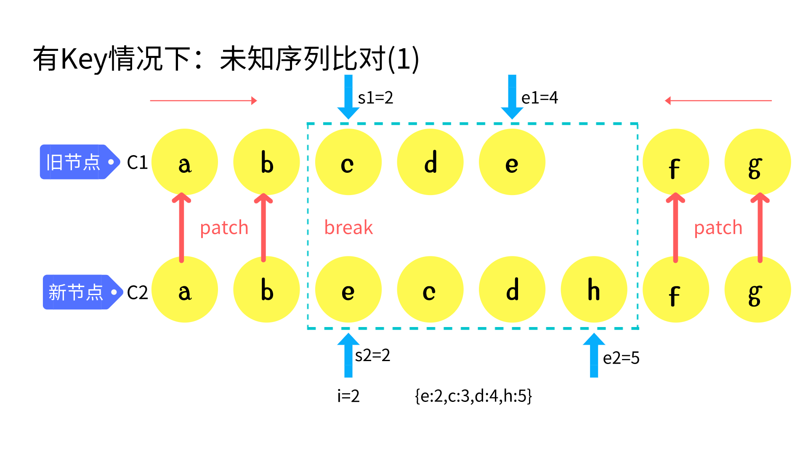
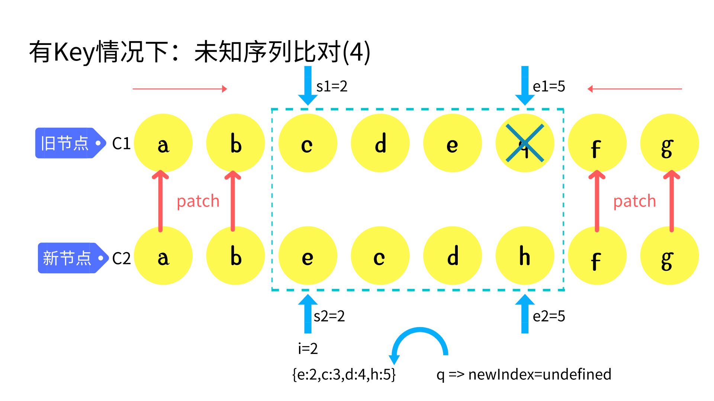

# 10. 实现 Diff 算法

## 1.前后元素不一致

> 两个不同虚拟节点不需要进行比较，直接移除老节点，将新的虚拟节点渲染成真实 DOM 进行挂载即可

```ts
export const isSameVNodeType = (n1, n2) => {
	return n1.type === n2.type && n1.key === n2.key;
};
const patch = (n1, n2, container) => {
	// 初始化和diff算法都在这里喲
	if (n1 == n2) {
		return;
	}
	if (n1 && !isSameVNodeType(n1, n2)) {
		// 有n1 是n1和n2不是同一个节点
		unmount(n1);
		n1 = null;
	}
	if (n1 == null) {
		// 初始化的情况
		mountElement(n2, container);
	} else {
		// diff算法
	}
};

const patch = (n1, n2, container) => {
	// ....
	processElement(n1, n2, container); // 封装对元素的处理逻辑
};
```

## 2.前后元素一致

> 前后元素一致则比较两个元素的属性和孩子节点

```ts
const patchProps = (oldProps, newProps, el) => {
	for (let key in newProps) {
		// 用新的生效
		hostPatchProp(el, key, oldProps[key], newProps[key]);
	}
	// 老的里面有新的没有则删除
	for (let key in oldProps) {
		if (!(key in newProps)) {
			hostPatchProp(el, key, oldProps[key], null);
		}
	}
};

const patchElement = (n1, n2) => {
	let el = (n2.el = n1.el);
	const oldProps = n1.props || {};
	const newProps = n2.props || {};
	patchProps(oldProps, newProps, el); // 比对新老属性
	patchChildren(n1, n2, el); // 比较元素的孩子节点
};
const processElement = (n1, n2, container) => {
	if (n1 == null) {
		mountElement(n2, container);
	} else {
		patchElement(n1, n2); // 比较两个元素
	}
};
```

## 3.子元素比较情况

| 新儿子 | 旧儿子 | 操作方式                     |
| ------ | ------ | ---------------------------- |
| 文本   | 数组   | （删除老儿子，设置文本内容） |
| 文本   | 文本   | （更新文本即可）             |
| 文本   | 空     | （更新文本即可) 与上面的类似 |
| 数组   | 数组   | （diff 算法）                |
| 数组   | 文本   | （清空文本，进行挂载）       |
| 数组   | 空     | （进行挂载） 与上面的类似    |
| 空     | 数组   | （删除所有儿子）             |
| 空     | 文本   | （清空文本）                 |
| 空     | 空     | （无需处理）                 |

### 子节点有三种情况： 文本、数组、没有儿子

- 1.新的是文本，老的是数组移除老的；
- 2.新的是文本，老的也是文本，内容不相同替换
- 3.老的是数组，新的是数组，全量 diff 算法
- 4.老的是数组，新的不是数组，移除老的子节点
- 5.老的是文本，新的是空
- 6.老的是文本，新的是数组

```ts
const unmountChildren = (children) => {
	for (let i = 0; i < children.length; i++) {
		unmount(children[i]);
	}
};
const patchChildren = (n1, n2, el) => {
	const c1 = n1 && n1.children;
	const c2 = n2.children;
	const prevShapeFlag = n1.shapeFlag;
	const shapeFlag = n2.shapeFlag;
	if (shapeFlag & ShapeFlags.TEXT_CHILDREN) {
		if (prevShapeFlag & ShapeFlags.ARRAY_CHILDREN) {
			unmountChildren(c1);
		}
		if (c1 !== c2) {
			hostSetElementText(el, c2);
		}
	} else {
		if (prevShapeFlag & ShapeFlags.ARRAY_CHILDREN) {
			if (shapeFlag & ShapeFlags.ARRAY_CHILDREN) {
			} else {
				unmountChildren(c1);
			}
		} else {
			if (prevShapeFlag & ShapeFlags.TEXT_CHILDREN) {
				hostSetElementText(el, '');
			}
			if (shapeFlag & ShapeFlags.ARRAY_CHILDREN) {
				mountChildren(c2, el);
			}
		}
	}
};
```

## 4.核心`Diff`算法

### sync from start



```ts
h('div',[
    h('li', { key: 'a' }, 'a'),
    h('li', { key: 'b' }, 'b'),
    h('li', { key: 'c' }, 'c')
]) :
h('div',[
    h('li', { key: 'a' }, 'a'),
    h('li', { key: 'b' }, 'b'),
    h('li', { key: 'd' }, 'd'),
    h('li', { key: 'e' }, 'e')
])


const patchKeydChildren = (c1, c2, container) => {
    let i = 0;
    const l2 = c2.length;
    let e1 = c1.length - 1;
    let e2 = l2 - 1;
    // 1. sync from start
    // (a b) c
    // (a b) d e
    while (i <= e1 && i <= e2) {
    const n1 = c1[i];
    const n2 = c2[i];
    if (isSameVNodeType(n1, n2)) {
        patch(n1, n2, container);
    } else {
        break;
    }
    i++;
    }
};
```

### sync from end



```ts
// 2. sync from end
// a (b c)
// d e (b c)
while (i <= e1 && i <= e2) {
	const n1 = c1[e1];
	const n2 = c2[e2];
	if (isSameVNodeType(n1, n2)) {
		patch(n1, n2, container);
	} else {
		break;
	}
	e1--;
	e2--;
}
```

### common sequence + mount





```ts
// 3. common sequence + mount
// (a b)
// (a b) c
// i = 2, e1 = 1, e2 = 2
// (a b)
// c (a b)
// i = 0, e1 = -1, e2 = 0
if (i > e1) {
	// 说明有新增
	if (i <= e2) {
		// 表示有新增的部分
		// 先根据e2 取他的下一个元素  和 数组长度进行比较
		const nextPos = e2 + 1;
		const anchor = nextPos < c2.length ? c2[nextPos].el : null;
		while (i <= e2) {
			patch(null, c2[i], container, anchor);
			i++;
		}
	}
}
```

### common sequence + unmount




```ts
// 4. common sequence + unmount
// (a b) c
// (a b)
// i = 2, e1 = 2, e2 = 1
// a (b c)
// (b c)
// i = 0, e1 = 0, e2 = -1
else if (i > e2) {
    while (i <= e1) {
        unmount(c1[i])
        i++
    }
}
```

### unknown sequence

#### `build key:index map for newChildren`



```ts
// 5. unknown sequence
// a b [c d e] f g
// a b [e c d h] f g
// i = 2, e1 = 4, e2 = 5
else {
    const s1 = i;
    const s2 = i;
    const keyToNewIndexMap = new Map();
    for (let i = s2; i <= e2; i++) {
        const nextChild = c2[i];
        keyToNewIndexMap.set(nextChild.key, i);
    }
}
```

#### `loop through old children left to be patched and try to patch`

```ts
// 标记新元素的，对应老元素的索引位置
const toBePatched = e2 - s2 + 1;
const newIndexToOldMapIndex = new Array(toBePatched).fill(0); //
for (let i = s1; i <= e1; i++) {
	const prevChild = c1[i];
	let newIndex = keyToNewIndexMap.get(prevChild.key); // 获取新的索引
	if (newIndex == undefined) {
		unmount(prevChild); // 老的有 新的没有直接删除
	} else {
		newIndexToOldMapIndex[newIndex - s2] = i + 1;
		patch(prevChild, c2[newIndex], container);
	}
}
```

#### move and mount



```ts
for (let i = toBePatched - 1; i >= 0; i--) {
	const nextIndex = s2 + i; // [ecdh]   找到h的索引
	const nextChild = c2[nextIndex]; // 找到 h
	let anchor = nextIndex + 1 < c2.length ? c2[nextIndex + 1].el : null; // 找到当前元素的下一个元素
	if (newIndexToOldMapIndex[i] == 0) {
		// 这是一个新元素 直接创建插入到 当前元素的下一个即可
		patch(null, nextChild, container, anchor);
	} else {
		// 根据参照物 将节点直接移动过去  所有节点都要移动 （但是有些节点可以不动）
		hostInsert(nextChild.el, container, anchor);
	}
}
```

## 5.最长递增子序列

### 最优情况

> Vue3 采用最长递增子序列，求解不需要移动的元素有哪些

```ts
function getSequence(arr) {
	const len = arr.length;
	const result = [0]; // 保存最长递增子序列的索引
	let resultLastIndex;

	for (let i = 0; i < len; i++) {
		const arrI = arr[i]; // 获取数组中的每一项，但是0 没有意义我们需要忽略掉
		if (arrI !== 0) {
			resultLastIndex = result[result.length - 1];
			if (arr[resultLastIndex] < arrI) {
				result.push(i); // 记录索引
				continue;
			}
		}
	}
	return result;
}
// 针对默认递增的序列进行优化
```

### 二分查找查找最长递增个数

```ts
function getSequence1(arr) {
	const len = arr.length;
	const result = [0]; // 保存最长递增子序列的索引
	let resultLastIndex;
	let start;
	let end;
	let middle = 0;
	for (let i = 0; i < len; i++) {
		const arrI = arr[i]; // 获取数组中的每一项，但是0 没有意义我们需要忽略掉
		if (arrI !== 0) {
			resultLastIndex = result[result.length - 1];
			if (arr[resultLastIndex] < arrI) {
				result.push(i); // 记录索引
				continue;
			}
			start = 0;
			end = result.length - 1; // 二分查找 前后索引
			while (start < end) {
				// 最终start = end
				middle = ((start + end) / 2) | 0; // 向下取整
				// 拿result中间值和最后一项比较
				if (arr[result[middle]] < arrI) {
					// 找比arrI大的值 或者等于arrI
					start = middle + 1;
				} else {
					end = middle;
				}
			}
			if (arrI < arr[result[start]]) {
				// 当前这个小就替换掉
				result[start] = i;
			}
		}
	}
	return result;
}
```

### 前驱节点追溯

假设有：\[2,3,1,5,6,8,7,9,4\] 为最新序列 -> 按照上述结果得出的结论为：\[ 2, 1, 8, 4, 6, 7 \]


```ts
function getSequence(arr) {
	// 最终的结果是索引
	const len = arr.length;
	const result = [0]; // 索引  递增的序列 用二分查找性能高
	const p = arr.slice(0); // 里面内容无所谓 和 原本的数组相同 用来存放索引
	let start;
	let end;
	let middle;
	for (let i = 0; i < len; i++) {
		// O(n)
		const arrI = arr[i];
		if (arrI !== 0) {
			let resultLastIndex = result[result.length - 1];
			// 取到索引对应的值
			if (arr[resultLastIndex] < arrI) {
				p[i] = resultLastIndex; // 标记当前前一个对应的索引
				result.push(i);
				// 当前的值 比上一个人大 ，直接push ，并且让这个人得记录他的前一个
				continue;
			}
			// 二分查找 找到比当前值大的那一个
			start = 0;
			end = result.length - 1;
			while (start < end) {
				// 重合就说明找到了 对应的值  // O(logn)
				middle = ((start + end) / 2) | 0; // 找到中间位置的前一个
				if (arr[result[middle]] < arrI) {
					start = middle + 1;
				} else {
					end = middle;
				} // 找到结果集中，比当前这一项大的数
			}
			// start / end 就是找到的位置
			if (arrI < arr[result[start]]) {
				// 如果相同 或者 比当前的还大就不换了
				if (start > 0) {
					// 才需要替换
					p[i] = result[start - 1]; // 要将他替换的前一个记住
				}
				result[start] = i;
			}
		}
	}
	let i = result.length; // 总长度
	let last = result[i - 1]; // 找到了最后一项
	while (i-- > 0) {
		// 根据前驱节点一个个向前查找
		result[i] = last; // 最后一项肯定是正确的
		last = p[last];
	}
	return result;
}
console.log(getSequence([2, 3, 1, 5, 6, 8, 7, 9, 4]));
```

### 优化`Diff`算法

利用最长递增子序列，优化`Diff`算法

```ts
// [5,3,4,0] => [1,2]
let increasingNewIndexSequence = getSequence(newIndexToOldMapIndex);
let j = increasingNewIndexSequence.length - 1; // 取出最后一个人的索引
for (let i = toBePatched - 1; i >= 0; i--) {
	let currentIndex = i + s2; // 找到h的索引
	let child = c2[currentIndex]; // 找到h对应的节点
	let anchor = currentIndex + 1 < c2.length ? c2[currentIndex + 1].el : null; // 第一次插入h 后 h是一个虚拟节点，同时插入后 虚拟节点会
	if (newIndexToOldMapIndex[i] == 0) {
		// 如果自己是0说明没有被patch过
		patch(null, child, container, anchor);
	} else {
		if (i != increasingNewIndexSequence[j]) {
			hostInsert(child.el, container, anchor); // 操作当前的d 以d下一个作为参照物插入
		} else {
			j--; // 跳过不需要移动的元素， 为了减少移动操作 需要这个最长递增子序列算法
		}
	}
}
```
