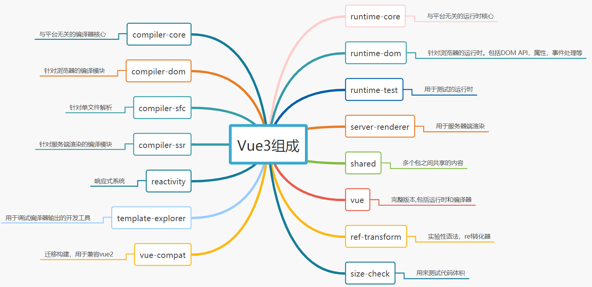
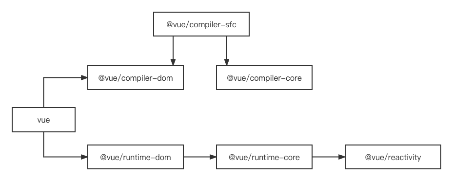
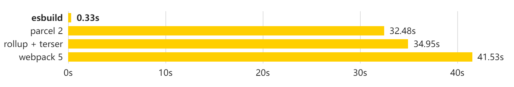

# 2. 开发环境搭建

## Vue3 项目结构





## 搭建 Monorepo 环境

Monorepo 是管理项目代码的一个方式，指在一个项目仓库(repo)中管理多个模块/包(package)。 Vue3 源码采用 monorepo 方式进行管理，将模块拆分到 package 目录中。作为一个个包来管理，这样职责划分更加明确。

- 一个仓库可维护多个模块，不用到处找仓库
- 方便版本管理和依赖管理，模块之间的引用，调用都非常方便

Vue3 中使用`pnpm` `workspace`来实现`monorepo` ([pnpm](https://pnpm.io/)是快速、节省磁盘空间的包管理器。主要采用符号链接的方式管理模块)

### 1.全局安装 pnpm

```sh
npm install pnpm -g # 全局安装pnpm
```

```sh
pnpm init  # 初始化配置文件
```

### 2.创建.npmrc 文件

```sh
shamefully-hoist = true
```

> 这里您可以尝试一下安装`Vue3`, `pnpm install vue`此时默认情况下`vue3`中依赖的模块不会被提升到`node_modules`下。 添加**羞耻的提升**可以将 Vue3，所依赖的模块提升到`node_modules`中

### 3.配置 workspace

新建 **pnpm-workspace.yaml**

```json
packages:
    - "packages/*"
```

> 将 packages 下所有的目录都作为包进行管理。这样我们的 Monorepo 就搭建好了。确实比`lerna + yarn workspace`更快捷

### 4.环境搭建

> 打包项目 Vue3 采用 rollup 进行打包代码，安装打包所需要的依赖

| 开发依赖   |                         |
| ---------- | ----------------------- |
| typescript | 在项目中支持 Typescript |
| esbuild    | 构建工具，默认支持 TS   |
| minimist   | 命令行参数解析          |

```sh
pnpm install typescript minimist esbuild -D -w
```

### 5.初始化 TS

复杂的框架项目开发，使用类型语言非常有利于代码的维护，在编码期间就可以帮我们做类型检查，避免错误。所以 TS 已经是主流框架的标配~

> Vue2 早期采用 Flow 来进行类型检测 （Vue2 中对 TS 支持并不友好）， Vue3 源码采用 Typescript 来进行重写。同时 Vue2.7 也采用 TS 进行重写。TS 能对代码提供良好的类型检查，同时也支持复杂的类型推导。

```sh
pnpm tsc --init
```

> 先添加些常用的`ts-config`配置，后续需要其他的在继续增加

```json
{
	"compilerOptions": {
		"outDir": "dist", // 输出的目录
		"sourceMap": true, // 采用sourcemap
		"target": "es2016", // 目标语法
		"module": "esnext", // 模块格式
		"moduleResolution": "node", // 模块解析方式
		"strict": false, // 严格模式
		"resolveJsonModule": true, // 解析json模块
		"esModuleInterop": true, // 允许通过es6语法引入commonjs模块
		"jsx": "preserve", // jsx 不转义
		"lib": ["esnext", "dom"] // 支持的类库 esnext及dom
	}
}
```

### 6.创建模块

> 我们现在`packages`目录下新建两个 package，用于下一章手写响应式原理做准备

- `reactivity` 响应式模块
- `shared` 共享模块

**所有包的入口均为`src/index.ts` 这样可以实现统一打包**

- `reactivity/package.json`

```json
{
	"name": "@vue/reactivity",
	"version": "1.0.0",
	"main": "index.js",
	"module": "dist/reactivity.esm-bundler.js",
	"unpkg": "dist/reactivity.global.js",
	"buildOptions": {
		"name": "VueReactivity",
		"formats": ["esm-bundler", "cjs", "global"]
	}
}
```

- `shared/package.json`

```json
{
	"name": "@vue/shared",
	"version": "1.0.0",
	"main": "index.js",
	"module": "dist/shared.esm-bundler.js",
	"buildOptions": {
		"formats": ["esm-bundler", "cjs"]
	}
}
```

> `formats` 为自定义的打包格式

- `global` 立即执行函数的格式，会暴露全局对象
- `esm-browser` 在浏览器中使用的格式，内联所有的依赖项。
- `esm-bundler` 在构建工具中使用的格式，不提供 `.prod` 格式，在构建应用程序时会被构建工具一起进行打包压缩。
- `cjs` 在 `node` 中使用的格式，服务端渲染。

```sh
pnpm install @vue/shared --workspace --filter @vue/reactivity
```

> 配置`ts`引用关系

```json
"baseUrl": ".",
"paths": {
    "@vue/*": ["packages/*/src"]
}
```

### 7.开发环境`esbuild`打包



创建开发时执行脚本， 参数为要打包的模块

**解析用户参数**

```json
"scripts": {
    "dev": "node scripts/dev.js reactivity -f esm"
}
```

```js
import esbuild from 'esbuild'; // 打包工具
import minimist from 'minimist'; // 命令行参数解析
import { resolve, dirname } from 'path';
import { fileURLToPath } from 'url';
import { createRequire } from 'module';
const require = createRequire(import.meta.url); // 可以在es6中使用require语法
const args = minimist(process.argv.slice(2)); // 解析打包格式和打包模块
const format = args.f || 'iife';
const target = args._[0] || 'reactivity';

// __dirname在es6模块中不存在需要自行解析
const __dirname = dirname(fileURLToPath(import.meta.url));

const pkg = require(`../packages/${target}/package.json`);

esbuild
	.context({
		entryPoints: [resolve(__dirname, `../packages/${target}/src/index.ts`)],
		outfile: resolve(
			// 输出的文件
			__dirname,
			`../packages/${target}/dist/${target}.js`
		),
		bundle: true, // 全部打包
		sourcemap: true, // sourcemap源码映射
		format, // 打包格式 esm , cjs, iife
		globalName: pkg.buildOptions?.name, // 全局名配置
		platform: 'browser' // 平台
	})
	.then((ctx) => {
		console.log('watching~~~');
		return ctx.watch(); // 监控文件变化
	});
```
