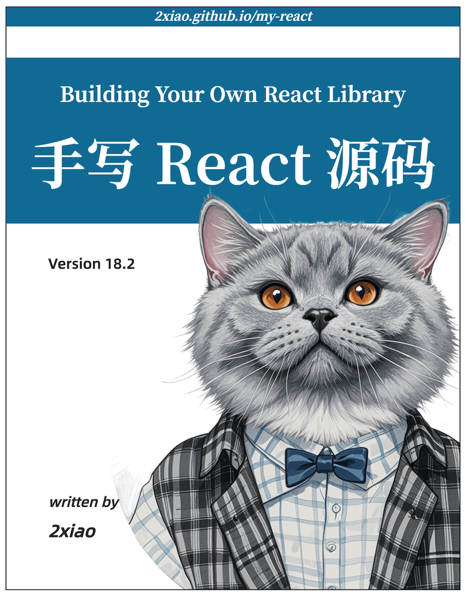

<!-- 

  

 -->

<b>《手写 Vue 源码》</b>

深入理解 Vue 源码，带你从零实现 Vue 3.4 的核心功能，构建自己的 Vue 库。

---

### 目录

| 章节          | 目录                                                                                                                                                                                                       |
| :------------ | :--------------------------------------------------------------------------------------------------------------------------------------------------------------------------------------------------------- |
| 整体架构      | [1. Vue3 设计思想](./1.md)   [2. 开发环境搭建](./2.md)                                                                                                                                                  |
| 响应式原理    | [3. 响应式数据核心](./3.md)   [4. Reactivity 模块](./4.md)   [5. Ref 的概念](./5.md)   [6. Computed 实现原理](./6.md)   [7. Watch & WatchEffect](./7.md)                                       |
| 渲染原理      | [8. 实现 runtime-dom](./8.md)   [9. 实现 runtime-core](./9.md)                                                                                                                                          |
| Diff 算法原理 | [10. 实现 Diff 算法](./10.md)                                                                                                                                                                              |
| 组件渲染原理  | [11. 实现 Text 和 Fragment](./11.md)   [12. 实现组件渲染](./12.md)   [13. 实现 setup 函数](./13.md)   [14. 实现函数式组件](./14.md)   [15. 依赖注入原理](./15.md)   [16. 实现 Ref](./16.md) |
| 其他实现原理  | [17. 实现 Teleport](./17.md)   [18. 实现 Transition](./18.md)   [19. 实现 KeepAlive](./19.md)   [20. 实现异步组件](./20.md)                                                                       |
| 模板编译原理  | [21. 编译优化](./21.md)   [22. 模板转化 AST 语法树](./22.md)   [23. 代码转化](./23.md)   [24. 代码生成](./24.md)                                                                                  |

---

### 关于书中的代码

教程地址：[https://2xiao.github.io/leetcode-js/vue](https://2xiao.github.io/leetcode-js/vue)

源代码地址：[https://github.com/2xiao/my-vue](https://github.com/2xiao/my-vue)

使用 Git Tag 划分迭代步骤，手把手带你实现 Vue 3.4 的核心功能。

欢迎「Star ⭐️ 」 和 「Fork」，这是对我最大的鼓励和支持。

---

### 关于本书的特色

- 教程详细，带你构建自己的 Vue 库；

- 按 Git Tag 划分迭代步骤，记录每个功能的实现过程；

---

### 学完本书你将收获

Vue 是由卓越工程师们在数年时间内精心打造的库，其中必定蕴含了许多值得借鉴的经验和智慧。

如果你渴望更进一步，不仅仅停留在 API 的使用层面，而是追求更深入前端技术的探索，那么掌握 Vue 源码将成为你技能提升的极佳途径。

本书遵循 Vue 源码的核心思想，通俗易懂的解析 Vue 源码，带你从零实现 Vue 3.4 的核心功能，学完本书，你将有这些收获：

1. 详解 Vue3 设计理念及整体架构思想，搭建 Vue3 开发环境。
2. 手写 Vue3 响应式原理，包括 reactive、effect、watch、computed、ref 等核心 API。
3. 掌握 Vue3 源码调试技巧，深入理解 Vue3 的内部机制。
4. 深入理解自定义渲染器原理及在 Runtime DOM 中的属性和事件处理方法。
5. 探索虚拟 DOM 的概念，手写 Vue3 中的 diff 算法以及最长递增子序列实现原理。
6. 手写 Vue3 组件的实现原理，深入理解组件的渲染、挂载流程，以及异步渲染的机制。
7. 掌握 Vue3 中生命周期的原理，以及 props、emit、slot、provide、inject 等功能的实现机制。
8. 学习编译优化技巧，掌握 patchFlags、blockTree 等实现靶向更新的方法。
9. 手写 Vue3 编译原理，掌握解析器、AST 语法树的优化、代码生成原理。
10. 理解 Vue3 中的异步组件、函数式组件、Teleport、keep-alive、Transition 组件的实现原理。

---

### 互动勘误

如果书中文章有所遗漏，欢迎点击所在页面左下角的按钮进行修改，感谢您的支持与帮助。

---

### 版权声明

本作品采用 知识署名-非商业性使用-禁止演绎 （BY-NC-ND） 4.0 国际许可[协议](https://creativecommons.org/licenses/by-nc-nd/4.0/legalcode.zh-Hans) 进行许可。

只要保持原作者署名和非商用，您可以自由地阅读、分享、修改本书。

[开始阅读 ->](./1.md)
